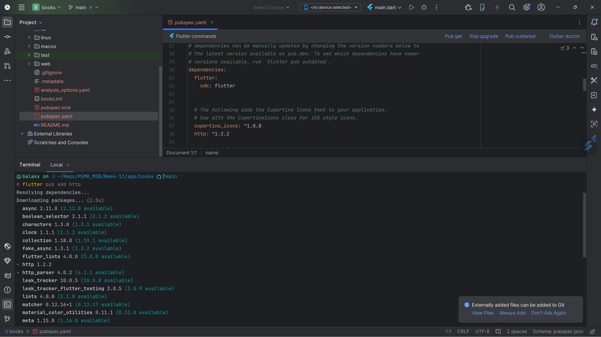
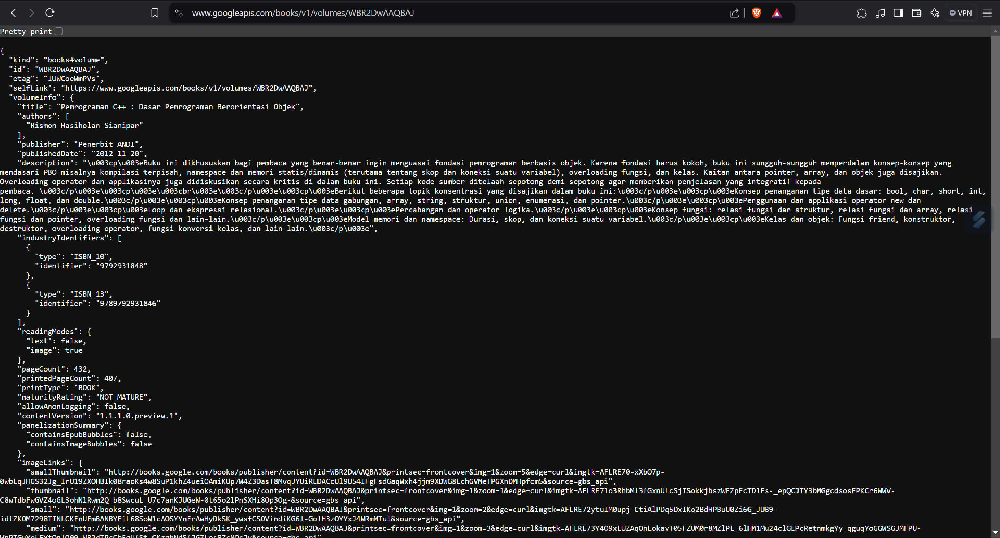

# 12 | Pemrograman Asynchronous

## Praktikum 1: Mengunduh Data dari Web Service (API)
### Langkah 1: Buat Project Baru
Buatlah sebuah project flutter baru dengan nama `books` di folder src `week-12` repository GitHub Anda.

Kemudian Tambahkan dependensi http dengan mengetik perintah `flutter pub get http`


### Langkah 2: Cek file pubspec.yaml
Jika berhasil install plugin, pastikan plugin http telah ada di file pubspec.


### Langkah 3: Buka file main.dart
Ketiklah kode seperti berikut ini.

> Soal 1
> Tambahkan nama panggilan Anda pada title app sebagai identitas hasil pekerjaan Anda.
```dart
import 'dart:async';
import 'package:flutter/material.dart';
import 'package:http/http.dart';
import 'package:http/http.dart' as http;

void main() {
  runApp(const MyApp());
}

class MyApp extends StatelessWidget {
  const MyApp({super.key});

  @override
  Widget build(BuildContext context) {
    return MaterialApp(
      title: 'Naufal',
      theme: ThemeData(
        primarySwatch: Colors.blue,
        visualDensity: VisualDensity.adaptivePlatformDensity,
      ),
      home: ,
    );
  }
}

class FuturePage extends StatefulWidget {
  const FuturePage({super.key});

  @override
  State<FuturePage> createState() => _FuturePageState();
}

class _FuturePageState extends State<FuturePage> {
  String result = '';

  @override
  Widget build(BuildContext context) {
    return Scaffold(
      appBar: AppBar(
        title: const Text('Back from the future'),
      ),
      body: Center(
        child: Column(children: [
          const Spacer(),
          ElevatedButton(
              onPressed: () {

          }, child: const Text('GO!')),
          const Spacer(),
          Text(result),
          const Spacer(),
          const CircularProgressIndicator(),
          const Spacer()
        ],),
      ),
    );
  }
}
```

### Langkah 4: Tambah method getData()
Tambahkan method berikut ke dalam class `_FuturePageState` yang berguna untuk mengambil data dari _API Google Books_.
```dart
Future<Response> getData() async {
    const authority = 'www.googleapis.com';
    const path = '/books/v1/volumes/WBR2DwAAQBAJ';
    Uri url = Uri.https(authority, path);
    return http.get(url);
}
```
> Soal 2
> Carilah judul buku favorit Anda di Google Books, lalu ganti ID buku pada variabel path di kode tersebut.
> 

### Langkah 5: Tambah kode di ElevatedButton
Tambahkan kode pada onPressed di ElevatedButton.
```dart
ElevatedButton(
    onPressed: () {
    setState(() {});
    getData().then((value) {
        result = value.body.toString().substring(0, 450);
        setState(() {});
    }).catchError((_) {
        result = 'An error occurrred';
        setState(() {});
    });
}, child: const Text('GO!')),
```
Lakukan run aplikasi Flutter Anda.

> Soal 3
> - Jelaskan maksud kode langkah 5 tersebut terkait substring dan catchError!
>   - `substring(0, 450)` berguna untuk membatasi panjang teks yang akan ditampilkan, sehingga hanya 450 karakter pertama dari data yang diambil yang akan ditampilkan dalam variabel result.
>   - `catchError` adalah metode yang digunakan untuk menangani kesalahan yang terjadi saat pemanggilan fungsi getData().
> - Capture hasil praktikum Anda berupa GIF dan lampirkan di README. Lalu lakukan commit dengan pesan "W12: Soal 3".
> 


## Praktikum 2: Menggunakan await/async untuk menghindari callbacks
## Praktikum 3: Menggunakan Completer di Future
## Praktikum 4: Memanggil Future secara paralel
## Praktikum 5: Menangani Respon Error pada Async Code
## Praktikum 6: Menggunakan Future dengan StatefulWidget
## Praktikum 7: Manajemen Future dengan FutureBuilder
## Praktikum 8: Navigation route dengan Future Function
## Praktikum 9: Memanfaatkan async/await dengan Widget Dialog