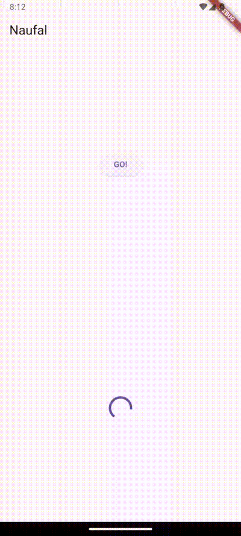
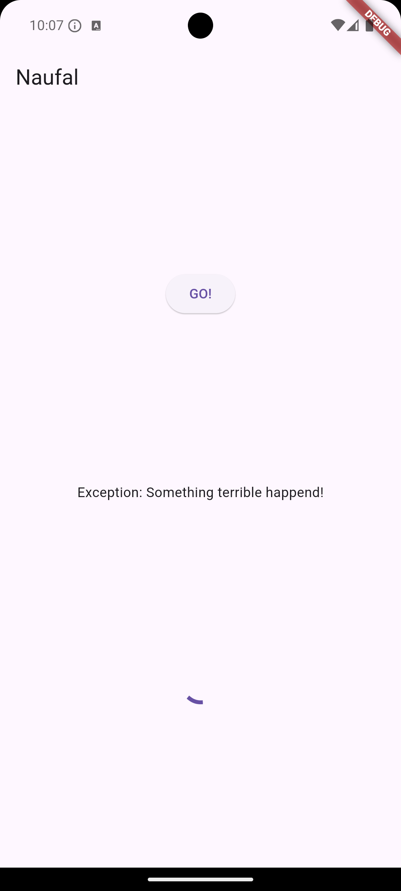
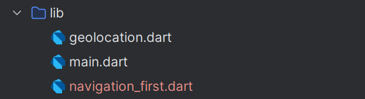
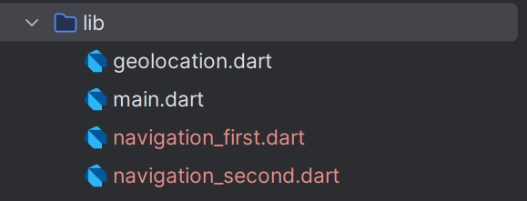
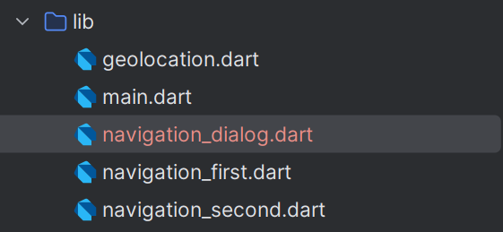
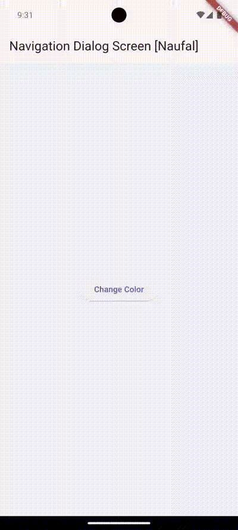

# 12 | Pemrograman Asynchronous

## Praktikum 1: Mengunduh Data dari Web Service (API)
### Langkah 1: Buat Project Baru
Buatlah sebuah project flutter baru dengan nama `books` di folder src `week-12` repository GitHub Anda.

Kemudian Tambahkan dependensi http dengan mengetik perintah `flutter pub get http`


### Langkah 2: Cek file pubspec.yaml
Jika berhasil install plugin, pastikan plugin http telah ada di file pubspec.


### Langkah 3: Buka file main.dart
Ketiklah kode seperti berikut ini.

> Soal 1
> Tambahkan nama panggilan Anda pada title app sebagai identitas hasil pekerjaan Anda.
```dart
import 'dart:async';
import 'package:flutter/material.dart';
import 'package:http/http.dart';
import 'package:http/http.dart' as http;

void main() {
  runApp(const MyApp());
}

class MyApp extends StatelessWidget {
  const MyApp({super.key});

  @override
  Widget build(BuildContext context) {
    return MaterialApp(
      title: 'Naufal',
      theme: ThemeData(
        primarySwatch: Colors.blue,
        visualDensity: VisualDensity.adaptivePlatformDensity,
      ),
      home: ,
    );
  }
}

class FuturePage extends StatefulWidget {
  const FuturePage({super.key});

  @override
  State<FuturePage> createState() => _FuturePageState();
}

class _FuturePageState extends State<FuturePage> {
  String result = '';

  @override
  Widget build(BuildContext context) {
    return Scaffold(
      appBar: AppBar(
        title: const Text('Back from the future'),
      ),
      body: Center(
        child: Column(children: [
          const Spacer(),
          ElevatedButton(
              onPressed: () {

          }, child: const Text('GO!')),
          const Spacer(),
          Text(result),
          const Spacer(),
          const CircularProgressIndicator(),
          const Spacer()
        ],),
      ),
    );
  }
}
```

### Langkah 4: Tambah method getData()
Tambahkan method berikut ke dalam class `_FuturePageState` yang berguna untuk mengambil data dari _API Google Books_.
```dart
Future<Response> getData() async {
    const authority = 'www.googleapis.com';
    const path = '/books/v1/volumes/WBR2DwAAQBAJ';
    Uri url = Uri.https(authority, path);
    return http.get(url);
}
```
> Soal 2
> Carilah judul buku favorit Anda di Google Books, lalu ganti ID buku pada variabel path di kode tersebut.
> 

### Langkah 5: Tambah kode di ElevatedButton
Tambahkan kode pada onPressed di ElevatedButton.
```dart
ElevatedButton(
    onPressed: () {
    setState(() {});
    getData().then((value) {
        result = value.body.toString().substring(0, 450);
        setState(() {});
    }).catchError((_) {
        result = 'An error occurrred';
        setState(() {});
    });
}, child: const Text('GO!')),
```
Lakukan run aplikasi Flutter Anda.

> Soal 3
> - Jelaskan maksud kode langkah 5 tersebut terkait substring dan catchError!
>   - `substring(0, 450)` berguna untuk membatasi panjang teks yang akan ditampilkan, sehingga hanya 450 karakter pertama dari data yang diambil yang akan ditampilkan dalam variabel result.
>   - `catchError` adalah metode yang digunakan untuk menangani kesalahan yang terjadi saat pemanggilan fungsi getData().
> - Capture hasil praktikum Anda berupa GIF dan lampirkan di README. Lalu lakukan commit dengan pesan "W12: Soal 3".
> 


## Praktikum 2: Menggunakan await/async untuk menghindari callbacks

### Langkah 1: Buka file main.dart
Tambahkan tiga method berisi kode seperti berikut di dalam class `_FuturePageState`.

```dart
Future<int> returnOneAsync() async {
  await Future.delayed(const Duration(seconds: 3));
  return 1;
}

Future<int> returnTwoAsync() async {
  await Future.delayed(const Duration(seconds: 3));
  return 2;
}

Future<int> returnThreeAsync() async {
  await Future.delayed(const Duration(seconds: 3));
  return 3;
}
```

### Langkah 2: Tambah method count()
Lalu tambahkan lagi method ini di bawah ketiga method sebelumnya.
```dart
Future count() async {
  int total = 0;
  total = await returnOneAsync();
  total += await returnTwoAsync();
  total += await returnThreeAsync();
  setState(() {
    result = total.toString();
  });
}
```

### Langkah 3: Panggil count()
Lakukan comment kode sebelumnya, ubah isi kode onPressed() menjadi seperti berikut.
```dart
ElevatedButton(
    onPressed: () {
      // setState(() {});
      // getData().then((value) {
      //   result = value.body.toString().substring(0, 450);
      //   setState(() {});
      // }).catchError((_) {
      //   result = 'An error occurrred';
      //   setState(() {});
      // });
      count();
}, child: const Text('GO!'))
```

### Langkah 4: Run
Akhirnya, run atau tekan F5 jika aplikasi belum running. Maka Anda akan melihat seperti gambar berikut, hasil angka 6 akan tampil setelah delay 9 detik.


> Soal 4
> - Jelaskan maksud kode langkah 1 dan 2 tersebut!
>   kode pada langkah 1 dan 2 di atas menunjukkan cara kerja pemanggilan `asynchronous` secara berurutan di Flutter menggunakan Future dan await. Dengan mendefinisikan tiga fungsi `asynchronous` yang masing-masing mengembalikan nilai setelah jeda waktu, kemudian memanggil fungsi-fungsi tersebut secara berurutan dalam fungsi `count()`, kita dapat menghitung total hasil dari ketiga fungsi tersebut. Fungsi `count()` memastikan setiap pemanggilan `asynchronous` selesai sebelum melanjutkan ke pemanggilan berikutnya, menghasilkan total akhir yang ditampilkan di UI setelah semua operasi selesai.
> - Capture hasil praktikum Anda berupa GIF dan lampirkan di README. Lalu lakukan commit dengan pesan "W12: Soal 4".


## Praktikum 3: Menggunakan Completer di Future

### Langkah 1: Buka main.dart
Pastikan telah impor package async berikut.
```dart
import 'package:async/async.dart';
```

### Langkah 2: Tambahkan variabel dan method
Tambahkan variabel late dan method di class _FuturePageState seperti ini.
```dart
late Completer completer;

Future getNumber() {
  completer = Completer<int>();
  calculate();
  return completer.future;
}

Future calculate() async {
  await Future.delayed(const Duration(seconds : 5));
  completer.complete(42);
}
```

### Langkah 3: Ganti isi kode onPressed()
Tambahkan kode berikut pada fungsi `onPressed()`. Kode sebelumnya bisa Anda comment.
```dart
ElevatedButton(
    onPressed: () {
      // setState(() {});
      // getData().then((value) {
      //   result = value.body.toString().substring(0, 450);
      //   setState(() {});
      // }).catchError((_) {
      //   result = 'An error occurrred';
      //   setState(() {});
      // });
      // count();
      getNumber().then((value) {
        setState(() {
          result = value.toString();
        });
      },);
}, child: const Text('GO!'))
```

### Langkah 4:
Terakhir, run atau tekan F5 untuk melihat hasilnya jika memang belum running. Bisa juga lakukan hot restart jika aplikasi sudah running. Maka hasilnya akan seperti gambar berikut ini. Setelah 5 detik, maka angka 42 akan tampil.


> Soal 5
> - Jelaskan maksud kode langkah 2 tersebut!
>   Kode tersebut menggunakan Completer untuk menghasilkan Future yang bisa dikendalikan secara manual. Method `getNumber()` memulai proses asynchronous `calculate()`, yang setelah jeda waktu 5 detik, menyelesaikan Future dengan nilai `42`. Teknik ini bermanfaat jika kita perlu menyelesaikan Future dengan cara atau waktu yang khusus, di luar kontrol otomatis dari mekanisme `async/await`.
> - Capture hasil praktikum Anda berupa `GIF` dan lampirkan di `README`. Lalu lakukan commit dengan pesan `"W12: Soal 5"`.

### Langkah 5: Ganti method calculate()
Gantilah isi code method `calculate()` seperti kode berikut, atau Anda dapat membuat `calculate2()`
```dart
calculate() async {
  try {
    await new Future.delayed(const Duration(seconds: 5));
    completer.complete(42);
  } catch (_) {
    completer.completeError({});
  }
}
```

### Langkah 6: Pindah ke onPressed()
Ganti menjadi kode seperti berikut.
```dart
getNumber().then((value) {
  setState(() {
    result = value.toString();
  });
}).catchError((e) {
  result = 'An error occurred';
});
```

> Soal 6
> - Jelaskan maksud perbedaan kode langkah 2 dengan langkah 5-6 tersebut!
> Modifikasi pada langkah 5 dan 6 lebih memfokuskan pada pemrosesan hasil `Future` di `UI` dan menambah penanganan error, sementara langkah 2 hanya membuat `Future` dengan `Completer` untuk mengatur penyelesaiannya secara manual tanpa langsung menampilkan hasil di `UI` atau menangani error.
> - Capture hasil praktikum Anda berupa GIF dan lampirkan di README. Lalu lakukan commit dengan pesan "W12: Soal 6".


## Praktikum 4: Memanggil Future secara paralel

### Langkah 1: Buka file main.dart
Tambahkan method ini ke dalam class `_FuturePageState`
```dart
void returnFG() {
  FutureGroup<int> futureGroup = FutureGroup<int>();
  futureGroup.add(returnOneAsync());
  futureGroup.add(returnTwoAsync());
  futureGroup.add(returnThreeAsync());
  futureGroup.close();
  futureGroup.future.then((value) {
    int total = 0;
    for (var element in value) {
      total += element;
    }
    setState(() {
      result = total.toString();
    });
  },);
}
```

### Langkah 2: Edit onPressed()
Anda bisa hapus atau comment kode sebelumnya, kemudian panggil method dari langkah 1 tersebut.
```dart
ElevatedButton(
    onPressed: () {
      returnFG();
}, child: const Text('GO!')),
```

### Langkah 3: Run
Anda akan melihat hasilnya dalam 3 detik berupa angka 6 lebih cepat dibandingkan praktikum sebelumnya menunggu sampai 9 detik.

> Soal 7
> Capture hasil praktikum Anda berupa `GIF` dan lampirkan di `README`. Lalu lakukan commit dengan pesan `"W12: Soal 7"`.


### Langkah 4: Ganti variabel futureGroup
Anda dapat menggunakan FutureGroup dengan `Future.wait` seperti kode berikut.

```dart
final futures = Future.wait<int>([
  returnOneAsync(),
  returnTwoAsync(),
  returnThreeAsync(),
]);
```


> Soal 8
> Jelaskan maksud perbedaan kode langkah 1 dan 4!
> - Fleksibilitas: FutureGroup memungkinkan penambahan Future secara dinamis, sedangkan Future.wait bekerja dengan daftar Future yang tetap.
> - Kompleksitas dan Kinerja: Future.wait lebih sederhana dan cocok untuk tugas paralel yang sudah terstruktur dengan baik, sementara FutureGroup lebih cocok untuk kasus di mana jumlah Future bisa berubah selama eksekusi.
>
> Keduanya sama-sama menjalankan Future secara paralel, namun FutureGroup memberikan kontrol lebih dinamis, sedangkan Future.wait lebih langsung dan efisien untuk situasi dengan daftar Future yang tetap.

## Praktikum 5: Menangani Respon Error pada Async Code

### Langkah 1: Buka file main.dart
Tambahkan method ini ke dalam `class _FuturePageState`
```dart
Future returnError() async {
  await Future.delayed(const Duration(seconds: 2));
  throw Exception("Something terrible happend!");
}
```

### Langkah 2: ElevatedButton
Ganti dengan kode berikut
```dart
ElevatedButton(
    onPressed: () {
      returnError().then((value) {
        setState(() {
          result = 'Succrss';
        });
      }).catchError((onError) {
        setState(() {
          result = onError.toString();
        });
      }).whenComplete(() => print('Complete'),);
}, child: const Text('GO!'))
```

### Langkah 3: Run
Lakukan run dan klik tombol GO! maka akan menghasilkan seperti gambar berikut.


### Langkah 4: Tambah method handleError()
Tambahkan kode ini di dalam class `_FutureStatePage`
```dart
Future handleError() async {
  try {
    await returnError();
  } catch (error) {
    setState(() {
      result = error.toString();
    });
  } finally {
    print('Complete');
  }
}
```


> Soal 10
> Panggil method `handleError()` tersebut di `ElevatedButton`, lalu run. Apa hasilnya? Jelaskan perbedaan kode langkah 1 dan 4!
> - Pendekatan Error Handling: Langkah 1 menggunakan method chaining (`catchError`), sedangkan Langkah 4 menggunakan `try-catch-finally` dalam metode `handleError()`.
> - Kontrol Eksekusi: Langkah 4 menawarkan struktur yang lebih terorganisir dengan `try-catch-finally`, sehingga semua tindakan (`error` handling dan pembersihan) dikelola dalam satu tempat.
> - Konsistensi Kode: Langkah 4 lebih cocok untuk situasi di mana Anda perlu memastikan tindakan spesifik setelah blok `try-catch`, seperti membersihkan data atau menutup koneksi.
>
> Pendekatan pada langkah 4 sering dianggap lebih jelas dan terstruktur, terutama dalam kasus kompleks atau di mana ada banyak tindakan setelah Future selesai.


## Praktikum 6: Menggunakan Future dengan StatefulWidget

### Langkah 1: install plugin geolocator
Tambahkan plugin geolocator dengan mengetik perintah berikut di terminal.
```bash
flutter pub add geolocator
```


### Langkah 2: Tambah permission GPS
Jika Anda menargetkan untuk platform Android, maka tambahkan baris kode berikut di file android/app/src/main/androidmanifest.xml
```xml
<uses-permission android:name="android.permission.ACCESS_FINE_LOCATION"/>
<uses-permission android:name="android.permission.ACCESS_COARSE_LOCATION"/>
```
File: `androidmanifest.xml`
```xml
<manifest xmlns:android="http://schemas.android.com/apk/res/android">
    <uses-permission android:name="android.permission.ACCESS_FINE_LOCATION"/>
    <uses-permission android:name="android.permission.ACCESS_COARSE_LOCATION"/>
    <application
        android:label="books"
        android:name="${applicationName}"
        android:icon="@mipmap/ic_launcher">
        <activity
            android:name=".MainActivity"
            android:exported="true"
            android:launchMode="singleTop"
            android:taskAffinity=""
            android:theme="@style/LaunchTheme"
            android:configChanges="orientation|keyboardHidden|keyboard|screenSize|smallestScreenSize|locale|layoutDirection|fontScale|screenLayout|density|uiMode"
            android:hardwareAccelerated="true"
            android:windowSoftInputMode="adjustResize">
            <!-- Specifies an Android theme to apply to this Activity as soon as
                 the Android process has started. This theme is visible to the user
                 while the Flutter UI initializes. After that, this theme continues
                 to determine the Window background behind the Flutter UI. -->
            <meta-data
              android:name="io.flutter.embedding.android.NormalTheme"
              android:resource="@style/NormalTheme"
              />
            <intent-filter>
                <action android:name="android.intent.action.MAIN"/>
                <category android:name="android.intent.category.LAUNCHER"/>
            </intent-filter>
        </activity>
        <!-- Don't delete the meta-data below.
             This is used by the Flutter tool to generate GeneratedPluginRegistrant.java -->
        <meta-data
            android:name="flutterEmbedding"
            android:value="2" />
    </application>
    <!-- Required to query activities that can process text, see:
         https://developer.android.com/training/package-visibility and
         https://developer.android.com/reference/android/content/Intent#ACTION_PROCESS_TEXT.

         In particular, this is used by the Flutter engine in io.flutter.plugin.text.ProcessTextPlugin. -->
    <queries>
        <intent>
            <action android:name="android.intent.action.PROCESS_TEXT"/>
            <data android:mimeType="text/plain"/>
        </intent>
    </queries>
</manifest>
```

### Langkah 3: Buat file geolocation.dart
Tambahkan file baru ini di folder lib project Anda.


### Langkah 4: Buat StatefulWidget
Buat class LocationScreen di dalam file geolocation.dart
```dart

import 'package:flutter/material.dart';

class LocationScreen extends StatefulWidget {
  const LocationScreen({super.key});

  @override
  State<LocationScreen> createState() => _LocationScreenState();
}

class _LocationScreenState extends State<LocationScreen> {
  @override
  Widget build(BuildContext context) {
    // TODO: implement build
    throw UnimplementedError();
  }
}
```

### Langkah 5: Isi kode geolocation.dart
```dart
import 'package:flutter/material.dart';
import 'package:geolocator/geolocator.dart';

class LocationScreen extends StatefulWidget {
  const LocationScreen({super.key});

  @override
  State<LocationScreen> createState() => _LocationScreenState();
}

class _LocationScreenState extends State<LocationScreen> {
  String myPosition = '';

  @override
  void initState() {
    super.initState();
    getPosition().then((Position myPos) {
      myPosition = 'Latitude: ${myPos.latitude.toString()} - Longitude: ${myPos.longitude.toString()}';
      setState(() {
        myPosition = myPosition;
      });
    },);
  }

  @override
  Widget build(BuildContext context) {
    return Scaffold(
      appBar: AppBar(title: const Text('Current Location [Naufal]'),),
      body: Center(child: Text(myPosition),),
    );
  }

  Future<Position> getPosition() async {
    await Geolocator.requestPermission();
    await Geolocator.isLocationServiceEnabled();
    Position? position = await Geolocator.getCurrentPosition();
    return position;
  }
}
```

### Langkah 6: Edit main.dart
Panggil screen baru tersebut di file main Anda seperti berikut.
```dart
@override
Widget build(BuildContext context) {
  return MaterialApp(
    title: 'Naufal',
    theme: ThemeData(
      primarySwatch: Colors.blue,
      visualDensity: VisualDensity.adaptivePlatformDensity,
    ),
    home: const LocationScreen(),
  );
}
```

### Langkah 7: Run
Run project Anda di device atau emulator (bukan browser), maka akan tampil seperti berikut ini.


### Langkah 8: Tambahkan animasi loading
Tambahkan widget loading seperti kode berikut. Lalu hot restart, perhatikan perubahannya.
```dart
@override
Widget build(BuildContext context) {
  final myWidget = myPosition == '' ?
    const CircularProgressIndicator() : Text(myPosition);

  return Scaffold(
    appBar: AppBar(title: const Text('Current Location [Naufal]'),),
    body: Center(child: myWidget,),
  );
}
```

> Soal 12
> - Jika Anda tidak melihat animasi loading tampil, kemungkinan itu berjalan sangat cepat. Tambahkan delay pada method getPosition() dengan kode await Future.delayed(const Duration(seconds: 3));
> - Apakah Anda mendapatkan koordinat GPS ketika run di browser? Mengapa demikian?
>   Program dapat berjalan dengan lancar di browser, dengan memberikan akses lokasi pada browser.
> - Capture hasil praktikum Anda berupa GIF dan lampirkan di README. Lalu lakukan commit dengan pesan "W12: Soal 12".


## Praktikum 7: Manajemen Future dengan FutureBuilder

### Langkah 1: Modifikasi method getPosition()
Buka file geolocation.dart kemudian ganti isi method dengan kode ini.
```dart
Future<Position> getPosition() async {
  await Geolocator.requestPermission();
  await Future.delayed(const Duration(seconds: 3));
  await Geolocator.isLocationServiceEnabled();
  Position? position = await Geolocator.getCurrentPosition();
  return position;
}
```

### Langkah 2: Tambah variabel
Tambah variabel ini di `class _LocationScreenState`
```dart
late Future<Position> position;
```

### Langkah 3: Tambah initState()
Tambah method ini dan set variabel position
```dart
@override
void initState() {
  super.initState();
  position = getPosition();
}
```

### Langkah 4: Edit method build()
Ketik kode berikut dan sesuaikan. Kode lama bisa Anda comment atau hapus.
```dart
@override
Widget build(BuildContext context) {
  final myWidget = myPosition == '' ?
    const CircularProgressIndicator() : Text(myPosition);
  return Scaffold(
    appBar: AppBar(title: const Text('Current Location [Naufal]'),),
    body: Center(child: FutureBuilder(
        future: position,
        builder: (BuildContext context,AsyncSnapshot<Position> snapshot) {
          if (snapshot.connectionState == ConnectionState.waiting) {
            return const CircularProgressIndicator();
          } else if (snapshot.connectionState == ConnectionState.done) {
            return Text(snapshot.data.toString());
          } else {
            return const Text('');
          }
        },
    ),),
  );
}
```

> Soal 13
> - Apakah ada perbedaan UI dengan praktikum sebelumnya? Mengapa demikian?
>   Perbedaan terdapat pada penulisan hasilnya, pada praktikum sebelumnya penulisan hasil dilakukan manual dengan mengambil masing-masing nilai `latitude` dan `longitude`, sedangkan pada praktikum kali ini penulisan hasil langsung diambil dari hasil fetch location yang kemudian dirubah menjadi string.
> - Capture hasil praktikum Anda berupa GIF dan lampirkan di README. Lalu lakukan commit dengan pesan "W12: Soal 13".
> - Seperti yang Anda lihat, menggunakan FutureBuilder lebih efisien, clean, dan reactive dengan Future bersama UI.


### Langkah 5: Tambah handling error
Tambahkan kode berikut untuk menangani ketika terjadi error. Kemudian hot restart.
```dart
else if (snapshot.connectionState == ConnectionState.done) {
  if (snapshot.hasError) {
     return Text('Something terrible happened!');
  }
  return Text(snapshot.data.toString());
}
```

> Soal 14
> - Apakah ada perbedaan UI dengan langkah sebelumnya? Mengapa demikian?
>   Tidak ada perbedaan dengan langkah sebelumnya, karena pada langkah 5 hanya menambahkan error handling, dimana error handling hanya akan diekseskusi ketika terdapat error ketika melakukan fetch data.
> - Capture hasil praktikum Anda berupa GIF dan lampirkan di README. Lalu lakukan commit dengan pesan "W12: Soal 14".


## Praktikum 8: Navigation route dengan Future Function

### Langkah 1: Buat file baru navigation_first.dart
Buatlah file baru ini di project lib Anda.


### Langkah 2: Isi kode navigation_first.dart
```dart
import 'package:flutter/material.dart';

class NavigationFirst extends StatefulWidget {
  const NavigationFirst({super.key});

  @override
  State<NavigationFirst> createState() => _NavigationFirstState();
}

class _NavigationFirstState extends State<NavigationFirst> {
  Color color = Colors.blue.shade700;
  @override
  Widget build(BuildContext context) {
    return Scaffold(
      backgroundColor: color,
      appBar: AppBar(
        title: const Text('Navigation First Screen [Naufal]'),
      ),
      body: Center(
        child: ElevatedButton(
            onPressed: () {
              _navigateAndGetColor(context);
            },
            child: const Text('Change Color')
        ),
      ),
    );
  }
}
```

> Soal 15
> - Tambahkan nama panggilan Anda pada tiap properti title sebagai identitas pekerjaan Anda.
> - Silakan ganti dengan warna tema favorit Anda.

### Langkah 3: Tambah method di class _NavigationFirstState
Tambahkan method ini.
```dart
Future _navigateAndGetColor(BuildContext context) async {
  color = await Navigator.push(context,
      MaterialPageRoute(builder: (context) => const NavigationSecond()),) ?? Colors.blue;
  setState(() {});
}
```

### Langkah 4: Buat file baru navigation_second.dart
Buat file baru ini di project lib Anda. Silakan jika ingin mengelompokkan view menjadi satu folder dan sesuaikan impor yang dibutuhkan.


### Langkah 5: Buat class NavigationSecond dengan StatefulWidget
```dart
import 'package:flutter/material.dart';

class NavigationSecond extends StatefulWidget {
  const NavigationSecond({super.key});

  @override
  State<NavigationSecond> createState() => _NavigationSecondState();
}

class _NavigationSecondState extends State<NavigationSecond> {
  @override
  Widget build(BuildContext context) {
    Color color;
    return Scaffold(
      appBar: AppBar(
        title: const Text('Navigation Second Screen [Naufal]'),
      ),
      body: Center(
        child: Column(
          mainAxisAlignment: MainAxisAlignment.spaceEvenly,
          children: [
            ElevatedButton(
                onPressed: () {
                  color = Colors.red.shade700;
                  Navigator.pop(context, color);
                },
                child: const Text('Red')),
            ElevatedButton(
                onPressed: () {
                  color = Colors.green.shade700;
                  Navigator.pop(context, color);
                },
                child: const Text('Green')),
            ElevatedButton(
                onPressed: () {
                  color = Colors.blue.shade700;
                  Navigator.pop(context, color);
                },
                child: const Text('Blue')),
          ],
        ),
      ),
    );
  }
}
```

### Langkah 6: Edit main.dart
Lakukan edit properti home.
```dart
class MyApp extends StatelessWidget {
  const MyApp({super.key});

  @override
  Widget build(BuildContext context) {
    return MaterialApp(
      title: 'Naufal',
      theme: ThemeData(
        primarySwatch: Colors.blue,
        visualDensity: VisualDensity.adaptivePlatformDensity,
      ),
      home: const NavigationFirst(),
    );
  }
}
```

### Langkah 8: Run
Lakukan run, jika terjadi error silakan diperbaiki.

> Soal 16
> - Cobalah klik setiap button, apa yang terjadi ? Mengapa demikian ?
>   Ketikan button `chane color` di klik maka akan membuka halaman baru yang berisi 3 button untuk pilihan warna. Ketika melakukan klik pada button pilihan warna tersebut maka akan kembali menuju halaman utama sebelumnya dengan warna background yang telah berubah sesuai dengan warna pada button yang kita pilih.
> - Gantilah 3 warna pada langkah 5 dengan warna favorit Anda!
> - Capture hasil praktikum Anda berupa GIF dan lampirkan di README. Lalu lakukan commit dengan pesan "W12: Soal 16".


## Praktikum 9: Memanfaatkan async/await dengan Widget Dialog

### Langkah 1: Buat file baru navigation_dialog.dart
Buat file dart baru di folder lib project Anda.


### Langkah 2: Isi kode navigation_dialog.dart
```dart
import 'package:flutter/material.dart';

class NavigationDialogScreen extends StatefulWidget {
  const NavigationDialogScreen({super.key});

  @override
  State<NavigationDialogScreen> createState() => _NavigationDialogScreenState();
}

class _NavigationDialogScreenState extends State<NavigationDialogScreen> {
  Color color = const Color(0xffF0F3FF);
  @override
  Widget build(BuildContext context) {
    return Scaffold(
      backgroundColor: color,
      appBar: AppBar(
        title: const Text('Navigation Dialog Screen [Naufal]'),
      ),
      body: Center(
        child: ElevatedButton(
            onPressed: () {

            },
            child: const Text('Change Color')),
      ),
    );
  }
}
```

### Langkah 3: Tambah method async
```dart
_showColorDialog(BuildContext context) async {
  await showDialog(
    context: context,
    barrierDismissible: false,
    builder: (_) {
      return AlertDialog(
        title: const Text('Very important question'),
        content: const Text('Please choose a color'),
        actions: <Widget>[
          TextButton(
              onPressed: () {
                color = const Color(0xff15F5BA);
                Navigator.pop(context, color);
              },
              child: const Text('Mint')),
          TextButton(
              onPressed: () {
                color = const Color(0xff836FFF);
                Navigator.pop(context, color);
              },
              child: const Text('Purple')),
          TextButton(
              onPressed: () {
                color = const Color(0xff211951);
                Navigator.pop(context, color);
              },
              child: const Text('Navy')),
        ],
      );
    },
  );
  setState(() {

  });
}
```

### Langkah 4: Panggil method di ElevatedButton
```dart
@override
Widget build(BuildContext context) {
  return Scaffold(
    backgroundColor: color,
    appBar: AppBar(
      title: const Text('Navigation Dialog Screen [Naufal]'),
    ),
    body: Center(
      child: ElevatedButton(
          onPressed: () {
            _showColorDialog(context);
          },
          child: const Text('Change Color')),
    ),
  );
}
```

### Langkah 5: Edit main.dart
Ubah properti home
```dart
@override
Widget build(BuildContext context) {
  return MaterialApp(
    title: 'Naufal',
    theme: ThemeData(
      primarySwatch: Colors.blue,
      visualDensity: VisualDensity.adaptivePlatformDensity,
    ),
    home: const NavigationDialogScreen(),
  );
}
```

### Langkah 6: Run
Coba ganti warna background dengan widget dialog tersebut.

> Soal 17
> - Cobalah klik setiap button, apa yang terjadi ? Mengapa demikian ?
>   Ketika button change color di-klik maka akan memunculkan sebuah dialog yang berisi pilihan button warna, ketika warna dipilih maka background halaman akan berubah sesuai dengan warna yang dipilih. Itu bisa terjadi karena setiap aksi dari button akan merubah isi dari variabel color.
> - Gantilah 3 warna pada langkah 3 dengan warna favorit Anda!
> - Capture hasil praktikum Anda berupa GIF dan lampirkan di README. Lalu lakukan commit dengan pesan "W12: Soal 17".

