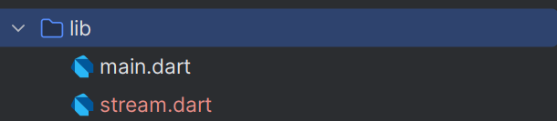

# #13 | Lanjutan State Management dengan Streams

## Praktikum 1: Dart Stream

### Langkah 1: Buat Project Baru
Buatlah sebuah project flutter baru dengan nama `stream_nama` (beri nama panggilan Anda) di folder `week-13/src/` repository GitHub Anda.

### Langkah 2: Buka file main.dart
```dart
import 'package:flutter/material.dart';

void main() {
  runApp(const MyApp());
}

class MyApp extends StatelessWidget {
  const MyApp({super.key});

  @override
  Widget build(BuildContext context) {
    return MaterialApp(
      title: 'Stream [Naufal]',
      theme: ThemeData(primarySwatch: Colors.deepPurple),
      home: const StreamHomePage()
    );
  }
}

class StreamHomePage extends StatefulWidget {
  const StreamHomePage({super.key});

  @override
  State<StreamHomePage> createState() => _StreamHomePageState();
}

class _StreamHomePageState extends State<StreamHomePage> {
  @override
  Widget build(BuildContext context) {
    return Container();
  }
}
```

> Soal 1
>
> - Tambahkan nama panggilan Anda pada title app sebagai identitas hasil pekerjaan Anda.
> - Gantilah warna tema aplikasi sesuai kesukaan Anda.
> - Lakukan commit hasil jawaban Soal 1 dengan pesan "W13: Jawaban Soal 1"

### Langkah 3: Buat file baru stream.dart
Buat file baru di folder lib project Anda. Lalu isi dengan kode berikut.


```dart
import 'package:flutter/material.dart';

class ColorStream {

}
```

### Langkah 4: Tambah variabel colors
Tambahkan variabel di dalam class ColorStream seperti berikut.
```dart
import 'package:flutter/material.dart';

class ColorStream {
  final List<Color> colors = [
    const Color(0xffE63946),
    const Color(0xfff1faee),
    const Color(0xffa8dadc),
    const Color(0xff457b9d),
    const Color(0xff1d3557),
  ];
}
```

> Soal 2
>
> - Tambahkan 5 warna lainnya sesuai keinginan Anda pada variabel colors tersebut.
> - Lakukan commit hasil jawaban Soal 2 dengan pesan "W13: Jawaban Soal 2"