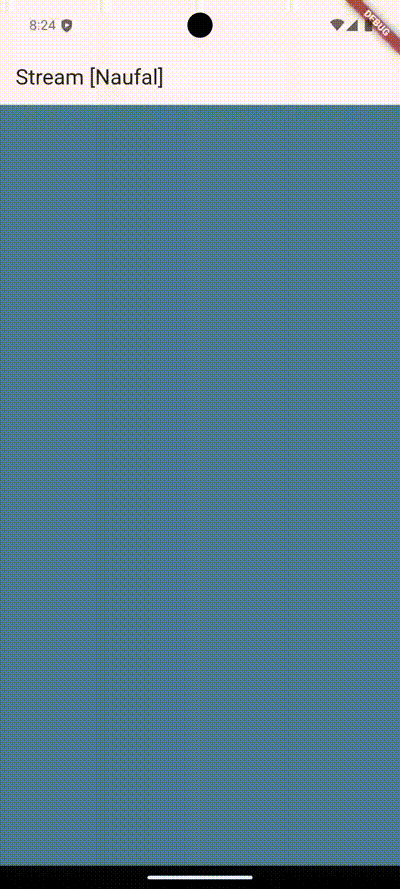

# #13 | Lanjutan State Management dengan Streams

## Praktikum 1: Dart Stream

### Langkah 1: Buat Project Baru
Buatlah sebuah project flutter baru dengan nama `stream_nama` (beri nama panggilan Anda) di folder `week-13/src/` repository GitHub Anda.

### Langkah 2: Buka file main.dart
```dart
import 'package:flutter/material.dart';

void main() {
  runApp(const MyApp());
}

class MyApp extends StatelessWidget {
  const MyApp({super.key});

  @override
  Widget build(BuildContext context) {
    return MaterialApp(
      title: 'Stream [Naufal]',
      theme: ThemeData(primarySwatch: Colors.deepPurple),
      home: const StreamHomePage()
    );
  }
}

class StreamHomePage extends StatefulWidget {
  const StreamHomePage({super.key});

  @override
  State<StreamHomePage> createState() => _StreamHomePageState();
}

class _StreamHomePageState extends State<StreamHomePage> {
  @override
  Widget build(BuildContext context) {
    return Container();
  }
}
```

> Soal 1
>
> - Tambahkan nama panggilan Anda pada title app sebagai identitas hasil pekerjaan Anda.
> - Gantilah warna tema aplikasi sesuai kesukaan Anda.
> - Lakukan commit hasil jawaban Soal 1 dengan pesan "W13: Jawaban Soal 1"

### Langkah 3: Buat file baru stream.dart
Buat file baru di folder lib project Anda. Lalu isi dengan kode berikut.


```dart
import 'package:flutter/material.dart';

class ColorStream {

}
```

### Langkah 4: Tambah variabel colors
Tambahkan variabel di dalam class ColorStream seperti berikut.
```dart
import 'package:flutter/material.dart';

class ColorStream {
  final List<Color> colors = [
    const Color(0xffE63946),
    const Color(0xfff1faee),
    const Color(0xffa8dadc),
    const Color(0xff457b9d),
    const Color(0xff1d3557),
  ];
}
```

> Soal 2
>
> - Tambahkan 5 warna lainnya sesuai keinginan Anda pada variabel colors tersebut.
> - Lakukan commit hasil jawaban Soal 2 dengan pesan "W13: Jawaban Soal 2"

### Langkah 5: Tambah method getColors()
Di dalam class ColorStream ketik method seperti kode berikut. Perhatikan tanda bintang di akhir keyword `async*` (ini digunakan untuk melakukan Stream data)
```dart
Stream<Color> getColors() async* {

}
```

### Langkah 6: Tambah perintah yield*
Tambahkan kode berikut ini.
```dart
Stream<Color> getColors() async* {
    yield* Stream.periodic(
        const Duration(seconds: 1), (int t) {
        int index = t % colors.length;
        return colors[index];
    });
}
```

> Soal 3
>
> - Jelaskan fungsi keyword yield* pada kode tersebut!
>   **`yield*`** meneruskan seluruh elemen dari *stream* `Stream.periodic(...)` ke dalam *stream* `getColors()` secara otomatis, menghasilkan nilai tanpa harus menulis `yield` berulang kali.
> - Apa maksud isi perintah kode tersebut?
>   Kode tersebut menghasilkan warna dari daftar `colors` setiap detik, berulang dari awal daftar setelah mencapai warna terakhir, sehingga membentuk pola warna berulang.
> - Lakukan commit hasil jawaban Soal 3 dengan pesan "W13: Jawaban Soal 3"

### Langkah 7: Buka main.dart
Ketik kode impor file ini pada file main.dart
```dart
import 'stream.dart';
```

### Langkah 8: Tambah variabel
Ketik dua properti ini di dalam `class _StreamHomePageState`
```dart
class _StreamHomePageState extends State<StreamHomePage> {
  Color bgColor = const Color(0xffE63946);
  late ColorStream colorStream;

  @override
  Widget build(BuildContext context) {
    return Container();
  }
}
```

### Langkah 9: Tambah method changeColor()
Tetap di file main, Ketik kode seperti berikut
```dart
void changeColor() async {
    await for (var eventColor in colorStream.getColors()) {
        setState(() {
        bgColor = eventColor;
        });
    }
}
```

### Langkah 10: Lakukan override initState()
Ketika kode seperti berikut
```dart
@override
void initState() {
    super.initState();
    colorStream = ColorStream();
    changeColor();
}
```

### Langkah 11: Ubah isi Scaffold()
Sesuaikan kode seperti berikut.
```dart
@override
Widget build(BuildContext context) {
    return Scaffold(
        appBar: AppBar(
        title: const Text("Stream [Naufal]"),
        ),
        body: Container(
        decoration: BoxDecoration(
            color: bgColor
        ),
        ),
    );
}
```

### Langkah 12: Run
Lakukan running pada aplikasi Flutter Anda, maka akan terlihat berubah warna background setiap detik.

> Soal 4
> - Capture hasil praktikum Anda berupa GIF dan lampirkan di README.
> - Lakukan commit hasil jawaban Soal 4 dengan pesan "W13: Jawaban Soal 4"



### Langkah 13: Ganti isi method changeColor()
Anda boleh comment atau hapus kode sebelumnya, lalu ketika kode seperti berikut.
```dart
void changeColor() async {
    colorStream.getColors().listen((eventColor) {
        setState(() {
        bgColor = eventColor;
        });
    },);
}
```

> Soal 5
>
> - Jelaskan perbedaan menggunakan listen dan await for (langkah 9) !
>   - **`await for`** digunakan untuk mengiterasi setiap nilai *stream* secara berurutan, sambil menunggu nilai berikutnya diproses satu per satu secara sinkron.
>   - **`listen`** menggunakan *callback* untuk menangani data secara asinkron, memungkinkan UI atau variabel diperbarui segera saat data diterima, tanpa perlu menunggu setiap nilai selesai diproses.
> - Lakukan commit hasil jawaban Soal 5 dengan pesan "W13: Jawaban Soal 5"