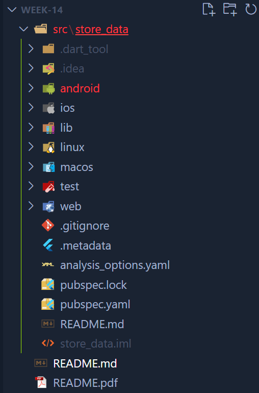
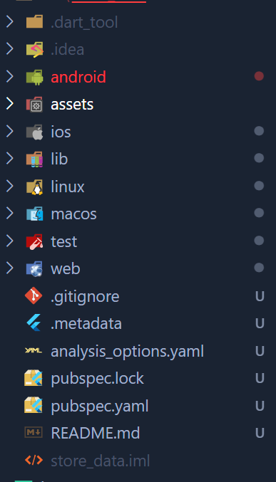
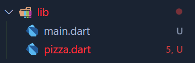
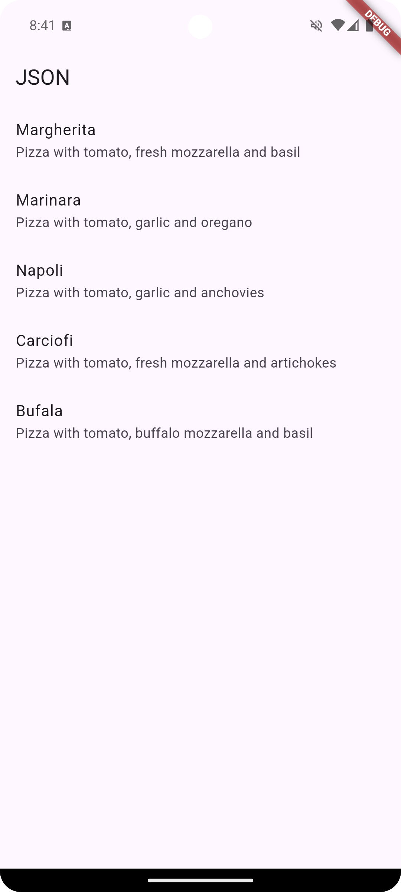

# #14 | PERSISTENSI DATA

## A. Praktikum 1: Converting Dart models into JSON
### 1. Di editor favorit Anda, buat proyek Flutter baru dan beri nama store_data


### 2. Pada file main.dart, hapus kode yang ada dan tambahkan kode awal untuk aplikasi dengan kode berikut:
```dart
import 'package:flutter/material.dart';

void main() {
  runApp(const MyApp());
}

class MyApp extends StatelessWidget {
  const MyApp({super.key});

  @override
  Widget build(BuildContext context) {
    return MaterialApp(
      title: 'Flutter JSON Demo',
      theme: ThemeData(primaryColor: Colors.blue),
      home: const MyHomePage(),
    );
  }
}

class MyHomePage extends StatefulWidget {
  const MyHomePage({super.key});

  @override
  State<MyHomePage> createState() => _MyHomePageState();
}

class _MyHomePageState extends State<MyHomePage> {
  @override
  Widget build(BuildContext context) {
    return Scaffold(
      appBar: AppBar(title: const Text('JSON'),),
    );
  }
}
```

### 3. Tambahkan folder baru ke root proyek Anda dengan nama assets.


### 4. Di dalam folder aset, buat file baru bernama pizzalist.json dan salin konten yang tersedia di tautan https://gist.github.com/simoales/a33c1c2abe78b48a75ccfd5fa0de0620 File ini berisi daftar objek JSON.
File `pizzalist.json`:
```json
[
    {
        "id": 1,
        "pizzaName": "Margherita",
        "description": "Pizza with tomato, fresh mozzarella and basil",
        "price": 8.75,
        "imageUrl": "images/margherita.png"
    },
    {
        "id": 2,
        "pizzaName": "Marinara",
        "description": "Pizza with tomato, garlic and oregano",
        "price": 7.50,
        "imageUrl": "images/marinara.png"
    },
    {
        "id": 3,
        "pizzaName": "Napoli",
        "description": "Pizza with tomato, garlic and anchovies",
        "price": 9.50,
        "imageUrl": "images/marinara.png"
    },
    {
        "id": 4,
        "pizzaName": "Carciofi",
        "description": "Pizza with tomato, fresh mozzarella and artichokes",
        "price": 8.80,
        "imageUrl": "images/marinara.png"
    },
    {
        "id": 5,
        "pizzaName": "Bufala",
        "description": "Pizza with tomato, buffalo mozzarella and basil",
        "price": 12.50,
        "imageUrl": "images/marinara.png"
    }
]
```

### 5. Di file pubspec.yaml, tambahkan referensi ke folder aset baru, seperti yang ditunjukkan di sini:
```yaml
flutter:

  uses-material-design: true

  assets:
    - assets/
```

### 6. Pada kelas _MyHomePageState, di main.dart, tambahkan sebuah variabel state bernama pizzaString:
```dart
class _MyHomePageState extends State<MyHomePage> {
  String pizzaString = '';

  @override
  Widget build(BuildContext context) {
    return Scaffold(
      appBar: AppBar(
        title: const Text('JSON'),
      ),
    );
  }
}
```

### 7. Untuk membaca isi file pizzalist.json, di bagian bawah kelas _MyHomePageState di main.dart, tambahkan metode asinkron baru yang disebut readJsonFile, yang akan mengatur nilai pizzaString, seperti yang ditunjukkan di sini:
```dart
Future readJsonFile() async {
    String myString = await DefaultAssetBundle.of(context)
        .loadString('assets/pizzalist.json');
    setState(() {
        pizzaString = myString;
    });
}
```

### 8. Pada kelas _MyHomePageState, timpa metode initState dan, di dalamnya, panggil metode readJsonFile:
```dart
@override
void initState() {
    super.initState();
    readJsonFile();
}
```

### 9. Sekarang, kita ingin menampilkan JSON yang diambil di properti dalam Scaffold. Untuk melakukannya, tambahkan widget Teks sebagai child dari Container kita:
```dart
@override
Widget build(BuildContext context) {
return Scaffold(
    appBar: AppBar(
    title: const Text('JSON'),
    ),
    body: Text(pizzaString),
);
}
```

### 10. Mari kita jalankan aplikasinya. Jika semuanya berjalan seperti yang diharapkan, Anda akan melihat konten file JSON di layar


### 11. Kita ingin mengubah String ini menjadi sebuah List of Objects. Kita akan mulai dengan membuat kelas baru. Dalam folder lib aplikasi kita, buat file baru bernama pizza.dart.


### 12. Di dalam file tersebut, tentukan properti kelas Pizza:
```dart
class Pizza {
  final int id;
  final String pizzaName;
  final String description;
  final double price;
  final String imageUrl;
}
```

### 13. Di dalam kelas Pizza, tentukan konstruktor bernama fromJson, yang akan mengambil sebuah Map sebagai parameter dan mengubah Map menjadi sebuah instance dari Pizza:
```dart
class Pizza {
  final int id;
  final String pizzaName;
  final String description;
  final double price;
  final String imageUrl;

  Pizza.fromJson(Map<String, dynamic> json)
      : id = json['id'],
        pizzaName = json['pizzaName'],
        description = json['descroption'],
        price = json['price'],
        imageUrl = json['imageUrl'];
}
```

### 14. Refaktor metode readJsonFile() pada kelas _MyHomePageState. Langkah pertama adalah mengubah String menjadi Map dengan memanggil metode jsonDecode. Pada method readJsonFile, tambahkan kode yang di cetak tebal berikut ini:
```dart
Future readJsonnFile() async {
    String myString = await DefaultAssetBundle.of(context)
    .loadString('assets/pizzalist.json');
    List pizzaMapList = jsonDecode(myString);
```

### 15. Pastikan editor Anda secara otomatis menambahkan pernyataan impor untuk pustaka "dart:convert" di bagian atas file main.dart; jika tidak, tambahkan saja secara manual. Tambahkan juga pernyataan impor untuk kelas pizza:
```dart
import 'dart:convert';

import 'package:flutter/material.dart';
import './pizza.dart';
```

### 16. Langkah terakhir adalah mengonversi string JSON kita menjadi List of native Dart objects. Kita dapat melakukan ini dengan mengulang pizzaMapList dan mengubahnya menjadi objek Pizza. Di dalam metode readJsonFile, di bawah metode jsonDecode, tambahkan kode berikut:
```dart
List<Pizza> myPizzas = [];
for (var pizza in pizzaMapList) {
    Pizza myPizza = Pizza.fromJson(pizza);
    myPizzas.add(myPizza);
}
```

### 17. Hapus atau beri komentar pada metode setState yang mengatur String pizzaString dan kembalikan daftar objek Pizza sebagai gantinya:
```dart
Future readJsonFile() async {
    String myString = await DefaultAssetBundle.of(context)
        .loadString('assets/pizzalist.json');
    List pizzaMapList = jsonDecode(myString);
    List<Pizza> myPizzas = [];
    for (var pizza in pizzaMapList) {
        Pizza myPizza = Pizza.fromJson(pizza);
        myPizzas.add(myPizza);
    }
    // setState(() {
    //   pizzaString = myString;
    // });
    return myPizzas;
}
```

### 18. Ubah signature metode sehingga Anda dapat menampilkan nilai balik secara eksplisit:
```dart
Future<List<Pizza>> readJsonFile() async {
    String myString = await DefaultAssetBundle.of(context)
        .loadString('assets/pizzalist.json');
    List pizzaMapList = jsonDecode(myString);
    List<Pizza> myPizzas = [];
    for (var pizza in pizzaMapList) {
        Pizza myPizza = Pizza.fromJson(pizza);
        myPizzas.add(myPizza);
    }
    // setState(() {
    //   pizzaString = myString;
    // });
    return myPizzas;
}
```

### 19. Sekarang kita memiliki objek List of Pizza. Daripada hanya menampilkan sebuah Teks kepada pengguna, kita dapat menampilkan sebuah ListView yang berisi sekumpulan widget ListTile. Di bagian atas kelas _MyHomePageState, buat List<Pizza> bernama myPizzas:
```dart
List<Pizza> myPizzas = [];
```

### 20. Dalam metode initState, pastikan Anda mengatur myPizzas dengan hasil panggilan ke readJsonFile:
```dart
@override
void initState() {
    super.initState();
    readJsonFile().then(
        (value) {
        setState(() {
            myPizzas = value;
        });
        },
    );
}
```

### 21. Tambahkan kode berikut ini di dalam Scaffold, di dalam metode build():
```dart
@override
Widget build(BuildContext context) {
    return Scaffold(
        appBar: AppBar(
        title: const Text('JSON'),
        ),
        body: ListView.builder(
        itemCount: myPizzas.length,
        itemBuilder: (context, index) {
            return ListTile(
            title: Text(myPizzas[index].pizzaName),
            subtitle: Text(myPizzas[index].description),
            );
        },
        ),
    );
}
```

### 22. Jalankan aplikasi. Antarmuka pengguna sekarang seharusnya jauh lebih ramah dan terlihat seperti yang ditunjukkan pada
