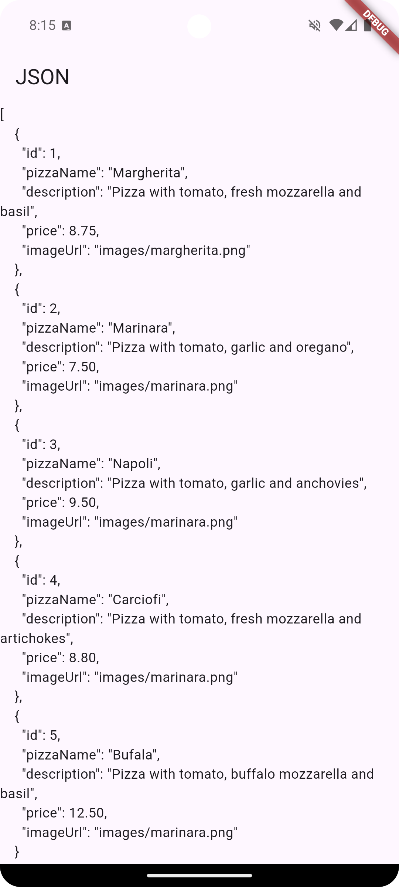
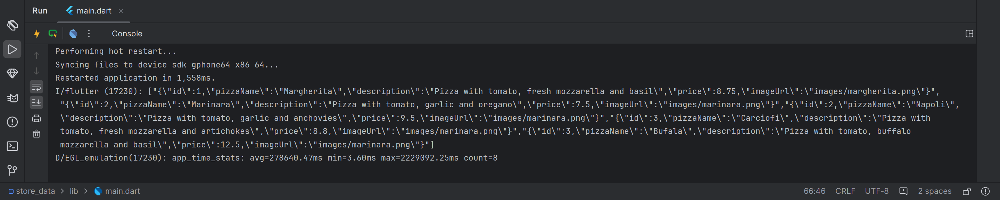
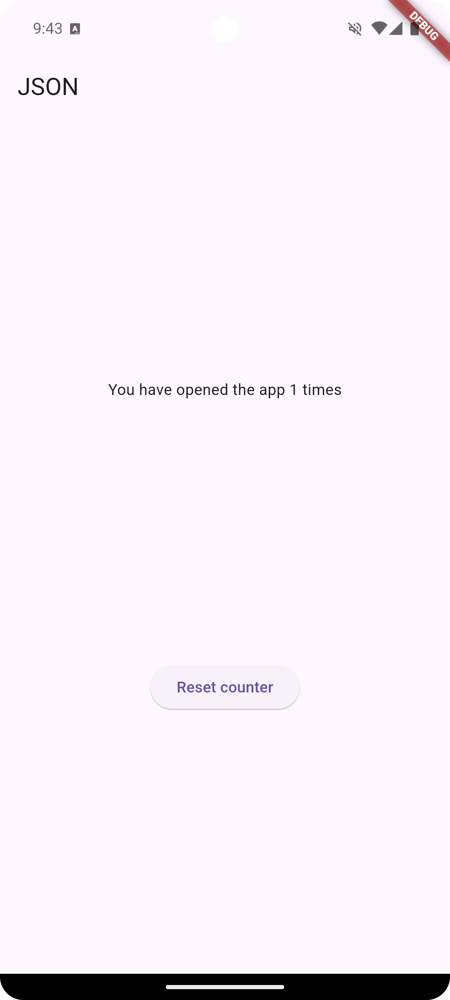
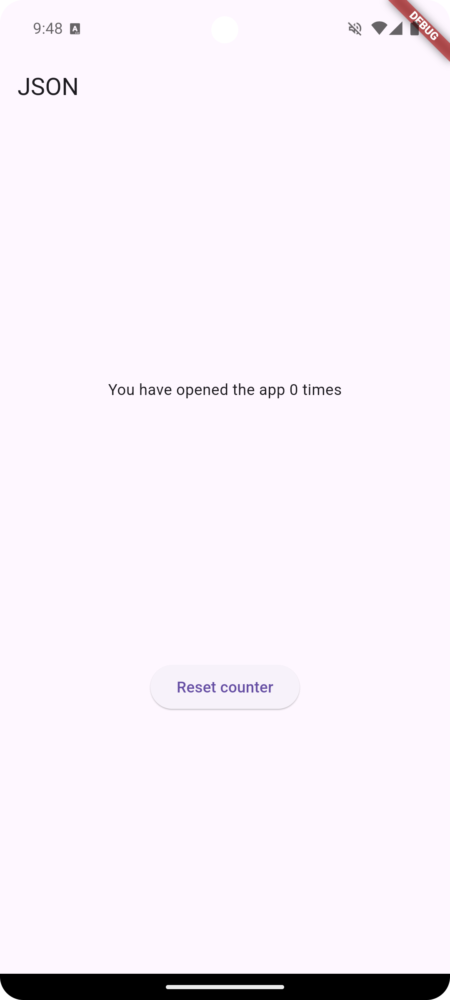
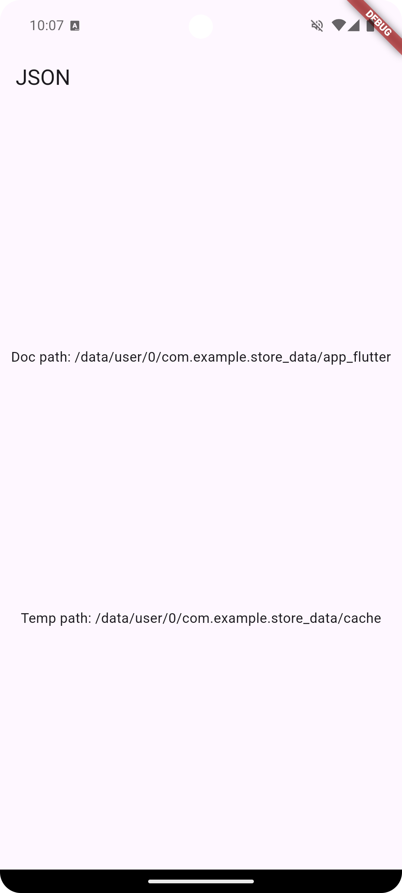

# #14 | PERSISTENSI DATA

## A. Praktikum 1: Converting Dart models into JSON
### 1. Di editor favorit Anda, buat proyek Flutter baru dan beri nama store_data


### 2. Pada file main.dart, hapus kode yang ada dan tambahkan kode awal untuk aplikasi dengan kode berikut:
```dart
import 'package:flutter/material.dart';

void main() {
  runApp(const MyApp());
}

class MyApp extends StatelessWidget {
  const MyApp({super.key});

  @override
  Widget build(BuildContext context) {
    return MaterialApp(
      title: 'Flutter JSON Demo',
      theme: ThemeData(primaryColor: Colors.blue),
      home: const MyHomePage(),
    );
  }
}

class MyHomePage extends StatefulWidget {
  const MyHomePage({super.key});

  @override
  State<MyHomePage> createState() => _MyHomePageState();
}

class _MyHomePageState extends State<MyHomePage> {
  @override
  Widget build(BuildContext context) {
    return Scaffold(
      appBar: AppBar(title: const Text('JSON'),),
    );
  }
}
```

### 3. Tambahkan folder baru ke root proyek Anda dengan nama assets.


### 4. Di dalam folder aset, buat file baru bernama pizzalist.json dan salin konten yang tersedia di tautan https://gist.github.com/simoales/a33c1c2abe78b48a75ccfd5fa0de0620 File ini berisi daftar objek JSON.
File `pizzalist.json`:
```json
[
    {
        "id": 1,
        "pizzaName": "Margherita",
        "description": "Pizza with tomato, fresh mozzarella and basil",
        "price": 8.75,
        "imageUrl": "images/margherita.png"
    },
    {
        "id": 2,
        "pizzaName": "Marinara",
        "description": "Pizza with tomato, garlic and oregano",
        "price": 7.50,
        "imageUrl": "images/marinara.png"
    },
    {
        "id": 3,
        "pizzaName": "Napoli",
        "description": "Pizza with tomato, garlic and anchovies",
        "price": 9.50,
        "imageUrl": "images/marinara.png"
    },
    {
        "id": 4,
        "pizzaName": "Carciofi",
        "description": "Pizza with tomato, fresh mozzarella and artichokes",
        "price": 8.80,
        "imageUrl": "images/marinara.png"
    },
    {
        "id": 5,
        "pizzaName": "Bufala",
        "description": "Pizza with tomato, buffalo mozzarella and basil",
        "price": 12.50,
        "imageUrl": "images/marinara.png"
    }
]
```

### 5. Di file pubspec.yaml, tambahkan referensi ke folder aset baru, seperti yang ditunjukkan di sini:
```yaml
flutter:

  uses-material-design: true

  assets:
    - assets/
```

### 6. Pada kelas _MyHomePageState, di main.dart, tambahkan sebuah variabel state bernama pizzaString:
```dart
class _MyHomePageState extends State<MyHomePage> {
  String pizzaString = '';

  @override
  Widget build(BuildContext context) {
    return Scaffold(
      appBar: AppBar(
        title: const Text('JSON'),
      ),
    );
  }
}
```

### 7. Untuk membaca isi file pizzalist.json, di bagian bawah kelas _MyHomePageState di main.dart, tambahkan metode asinkron baru yang disebut readJsonFile, yang akan mengatur nilai pizzaString, seperti yang ditunjukkan di sini:
```dart
Future readJsonFile() async {
    String myString = await DefaultAssetBundle.of(context)
        .loadString('assets/pizzalist.json');
    setState(() {
        pizzaString = myString;
    });
}
```

### 8. Pada kelas _MyHomePageState, timpa metode initState dan, di dalamnya, panggil metode readJsonFile:
```dart
@override
void initState() {
    super.initState();
    readJsonFile();
}
```

### 9. Sekarang, kita ingin menampilkan JSON yang diambil di properti dalam Scaffold. Untuk melakukannya, tambahkan widget Teks sebagai child dari Container kita:
```dart
@override
Widget build(BuildContext context) {
return Scaffold(
    appBar: AppBar(
    title: const Text('JSON'),
    ),
    body: Text(pizzaString),
);
}
```

### 10. Mari kita jalankan aplikasinya. Jika semuanya berjalan seperti yang diharapkan, Anda akan melihat konten file JSON di layar


### 11. Kita ingin mengubah String ini menjadi sebuah List of Objects. Kita akan mulai dengan membuat kelas baru. Dalam folder lib aplikasi kita, buat file baru bernama pizza.dart.


### 12. Di dalam file tersebut, tentukan properti kelas Pizza:
```dart
class Pizza {
  final int id;
  final String pizzaName;
  final String description;
  final double price;
  final String imageUrl;
}
```

### 13. Di dalam kelas Pizza, tentukan konstruktor bernama fromJson, yang akan mengambil sebuah Map sebagai parameter dan mengubah Map menjadi sebuah instance dari Pizza:
```dart
class Pizza {
  final int id;
  final String pizzaName;
  final String description;
  final double price;
  final String imageUrl;

  Pizza.fromJson(Map<String, dynamic> json)
      : id = json['id'],
        pizzaName = json['pizzaName'],
        description = json['descroption'],
        price = json['price'],
        imageUrl = json['imageUrl'];
}
```

### 14. Refaktor metode readJsonFile() pada kelas _MyHomePageState. Langkah pertama adalah mengubah String menjadi Map dengan memanggil metode jsonDecode. Pada method readJsonFile, tambahkan kode yang di cetak tebal berikut ini:
```dart
Future readJsonnFile() async {
    String myString = await DefaultAssetBundle.of(context)
    .loadString('assets/pizzalist.json');
    List pizzaMapList = jsonDecode(myString);
```

### 15. Pastikan editor Anda secara otomatis menambahkan pernyataan impor untuk pustaka "dart:convert" di bagian atas file main.dart; jika tidak, tambahkan saja secara manual. Tambahkan juga pernyataan impor untuk kelas pizza:
```dart
import 'dart:convert';

import 'package:flutter/material.dart';
import './pizza.dart';
```

### 16. Langkah terakhir adalah mengonversi string JSON kita menjadi List of native Dart objects. Kita dapat melakukan ini dengan mengulang pizzaMapList dan mengubahnya menjadi objek Pizza. Di dalam metode readJsonFile, di bawah metode jsonDecode, tambahkan kode berikut:
```dart
List<Pizza> myPizzas = [];
for (var pizza in pizzaMapList) {
    Pizza myPizza = Pizza.fromJson(pizza);
    myPizzas.add(myPizza);
}
```

### 17. Hapus atau beri komentar pada metode setState yang mengatur String pizzaString dan kembalikan daftar objek Pizza sebagai gantinya:
```dart
Future readJsonFile() async {
    String myString = await DefaultAssetBundle.of(context)
        .loadString('assets/pizzalist.json');
    List pizzaMapList = jsonDecode(myString);
    List<Pizza> myPizzas = [];
    for (var pizza in pizzaMapList) {
        Pizza myPizza = Pizza.fromJson(pizza);
        myPizzas.add(myPizza);
    }
    // setState(() {
    //   pizzaString = myString;
    // });
    return myPizzas;
}
```

### 18. Ubah signature metode sehingga Anda dapat menampilkan nilai balik secara eksplisit:
```dart
Future<List<Pizza>> readJsonFile() async {
    String myString = await DefaultAssetBundle.of(context)
        .loadString('assets/pizzalist.json');
    List pizzaMapList = jsonDecode(myString);
    List<Pizza> myPizzas = [];
    for (var pizza in pizzaMapList) {
        Pizza myPizza = Pizza.fromJson(pizza);
        myPizzas.add(myPizza);
    }
    // setState(() {
    //   pizzaString = myString;
    // });
    return myPizzas;
}
```

### 19. Sekarang kita memiliki objek List of Pizza. Daripada hanya menampilkan sebuah Teks kepada pengguna, kita dapat menampilkan sebuah ListView yang berisi sekumpulan widget ListTile. Di bagian atas kelas _MyHomePageState, buat List<Pizza> bernama myPizzas:
```dart
List<Pizza> myPizzas = [];
```

### 20. Dalam metode initState, pastikan Anda mengatur myPizzas dengan hasil panggilan ke readJsonFile:
```dart
@override
void initState() {
    super.initState();
    readJsonFile().then(
        (value) {
        setState(() {
            myPizzas = value;
        });
        },
    );
}
```

### 21. Tambahkan kode berikut ini di dalam Scaffold, di dalam metode build():
```dart
@override
Widget build(BuildContext context) {
    return Scaffold(
        appBar: AppBar(
        title: const Text('JSON'),
        ),
        body: ListView.builder(
        itemCount: myPizzas.length,
        itemBuilder: (context, index) {
            return ListTile(
            title: Text(myPizzas[index].pizzaName),
            subtitle: Text(myPizzas[index].description),
            );
        },
        ),
    );
}
```

### 22. Jalankan aplikasi. Antarmuka pengguna sekarang seharusnya jauh lebih ramah dan terlihat seperti yang ditunjukkan pada


## B. Praktikum 2: Reading the JSON file
### 1. Tambahkan metode baru ke kelas Pizza, di file pizza.dart, yang disebut toJson. Ini akan mengembalikan sebuah Map<String, dynamic> dari objek:
```dart
 Map<String, dynamic> toJson() {
    return {
        'id': id.bitLength,
        'pizzaName': pizzaName,
        'description': description,
        'price': price,
        'imageUrl': imageUrl
    };
}
```
### 2. Setelah Anda memiliki sebuah Map, Anda dapat menserialisasikannya kembali ke dalam string JSON. Tambahkan metode baru di di bagian bawah kelas _MyHomePageState, di dalam file main.dart, yang disebut convertToJSON:
```dart
String convertToJSON(List<Pizza> pizzas) {
    return jsonEncode(pizzas
        .map(
            (pizza) => jsonEncode(pizza),
        )
        .toList());
}
```

### 3. Metode ini mengubah objek List of Pizza kembali menjadi string Json dengan memanggil metode jsonEncode lagi di pustaka dart_convert.

### 4. Terakhir, mari panggil metode tersebut dan cetak string JSON di Debug Console. Tambahkan kode berikut ke metode readJsonFile, tepat sebelum mengembalikan List myPizzas:
```dart
Future<List<Pizza>> readJsonFile() async {
    String myString = await DefaultAssetBundle.of(context)
        .loadString('assets/pizzalist.json');
    List pizzaMapList = jsonDecode(myString);
    List<Pizza> myPizzas = [];
    for (var pizza in pizzaMapList) {
        Pizza myPizza = Pizza.fromJson(pizza);
        myPizzas.add(myPizza);
    }
    // setState(() {
    //   pizzaString = myString;
    // });
    String json = convertToJSON(myPizzas);
    print(json);
    return myPizzas;
}
```

### 5. Jalankan aplikasi. Anda akan melihat string JSON dicetak, seperti yang ditunjukkan pada gambar berikut:



## C. Praktikum 3: Saving data simply with SharedPreferences
### 1. Gunakan project pada pertemuan 11 bernama books. Pertama, tambahkan ketergantungan pada shared_preferences. Dari Terminal Anda, ketikkan perintah berikut
```bash
flutter pub add shared_preferences
```

### 2. Untuk memperbarui dependensi dalam proyek Anda, jalankan perintah flutter pub get dari jendela Terminal.
```bash
flutter pub get
```

### 3. Di bagian atas file main.dart, impor shared_preferences:
```dart
import 'package:shared_preferences/shared_preferences.dart';
```

### 4. Di bagian atas kelas _MyHomePageState, buat variabel status integer baru bernama appCounter:
```dart
int appCounter = 0;
```

### 5. Dalam kelas _MyHomePageState, buat metode asinkron baru yang disebut readAndWritePreferences():
```dart
Future readAndWritePreference() async {}
```

### 6. Di dalam metode readAndWritePreference, buatlah sebuah instance dari SharedPreferences:
```dart
SharedPreferences prefs = await SharedPreferences.getInstance();
```

### 7. Setelah membuat instance preferensi, kita membuat kode yang mencoba baca nilai kunci appCounter. Jika nilainya nol, setel ke 0; lalu naikkan nilainya:
```dart
appCounter = prefs.getInt('appCounter') ?? 0;
appCounter++;
```

### 8. Setelah itu, atur nilai kunci appCounter di preferensi ke nilai baru:
```dart
await prefs.setInt('appCounter', appCounter);
```

### 9. Memperbarui nilai status appCounter:
```dart
setState(() {
    appCounter = appCounter;
});
```

### 10. Pada metode initState di kelas _MyHomePageState, panggil metode readAndWritePreference() dengan kode yang dicetak tebal:
```dart
@override
void initState() {
    super.initState();
    readAndWritePreference();
}
```

### 11. Dalam metode build, tambahkan kode berikut ini di dalam widget Container:
```dart
@override
Widget build(BuildContext context) {
    return Scaffold(
        appBar: AppBar(
        title: const Text('JSON'),
        ),
        body: Center(
        child: Column(
            mainAxisAlignment: MainAxisAlignment.spaceEvenly,
            children: [
            Text('You have opened the app $appCounter times'),
            ElevatedButton(
                onPressed: () {

                },
                child: Text('Reset counter')
            )
            ],
        ),
        )
    );
}
```

### 12. Jalankan aplikasi. Saat pertama kali membukanya, Anda akan melihat layar yang mirip dengan yang berikut ini:


### 13. Tambahkan metode baru ke kelas _MyHomePageState yang disebut deletePreference(), yang akan menghapus nilai yang disimpan:
```dart
Future deletePreference() async {
    SharedPreferences prefs = await SharedPreferences.getInstance();
    await prefs.clear();
    setState(() {
      appCounter = 0;
    });
}
```

### 14. Dari properti onPressed dari widget ElevatedButton di metode build(), memanggil metode deletePreference(), dengan kode di cetak tebal:
```dart
@override
Widget build(BuildContext context) {
    return Scaffold(
        appBar: AppBar(
            title: const Text('JSON'),
        ),
        body: Center(
            child: Column(
            mainAxisAlignment: MainAxisAlignment.spaceEvenly,
            children: [
                Text('You have opened the app $appCounter times'),
                ElevatedButton(
                    onPressed: () {
                    deletePreference();
                    },
                    child: Text('Reset counter'))
            ],
            ),
        ));
}
```

### 15. Jalankan aplikasi lagi. Sekarang, saat Anda menekan tombol Reset penghitung, nilai appCounter akan dihapus



## D. Praktikum 4: Accessing the filesystem, part 1: path_provider Buatlah project flutter baru dengan nama path_provider
### 1. menambahkan dependency yang relevan ke file pubspec.yaml. Tambahkan path_provider dengan mengetikkan perintah ini dari Terminal Anda:
```bash
flutter pub add path_provider
```

### 2. Di bagian atas file main.dart, tambahkan impor path_provider:
```dart
import 'package:path_provider/path_provider.dart';
```

### 3. Di bagian atas kelas _MyHomePageState, tambahkan variabel State yang akan kita gunakan untuk memperbarui antarmuka pengguna:
```dart
String documentsPath = '';
String tempPath = '';
```

### 4. Masih dalam kelas _MyHomePageState, tambahkan metode untuk mengambil direktori temporary dan dokumen:
```dart
Future getPaths() async {
    final docDir = await getApplicationDocumentsDirectory();
    final tempDir = await getTemporaryDirectory();
    setState(() {
        documentsPath = docDir.path;
        tempPath = tempDir.path;
    });
}
```

### 5. Pada metode initState dari kelas _MyHomePageState, panggil metode getPaths:
```dart
@override
void initState() {
    super.initState();
    getPaths();
}
```

### 6. Pada metode build _MyHomePageState, buat UI dengan dua widget Teks yang menunjukkan path yang diambil:
```dart
@override
Widget build(BuildContext context) {
    return Scaffold(
        appBar: AppBar(
            title: const Text('JSON'),
        ),
        body: Center(
            child: Column(
            mainAxisAlignment: MainAxisAlignment.spaceEvenly,
            children: [
                Text('Doc path: $documentsPath'),
                Text('Temp path: $tempPath'),
            ],
            ),
        ));
}
```

### 7. Jalankan aplikasi. Anda akan melihat layar yang terlihat seperti berikut ini:

