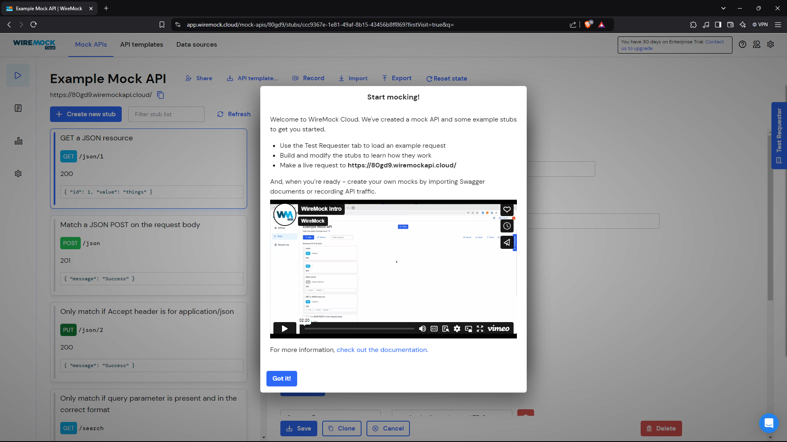
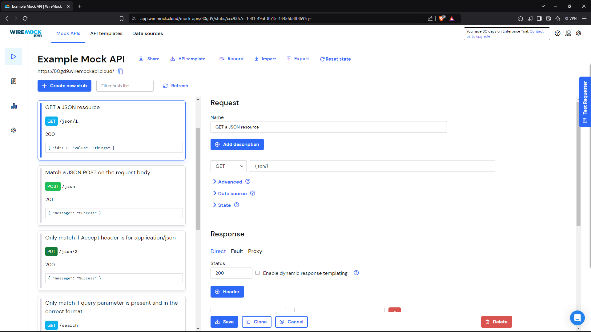
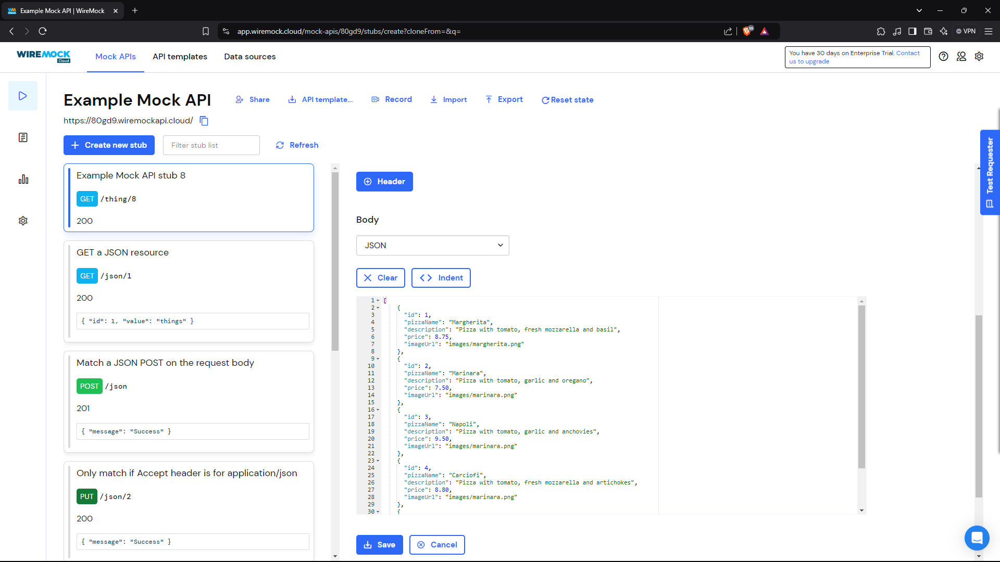
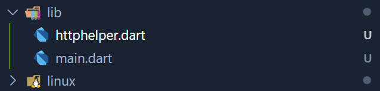
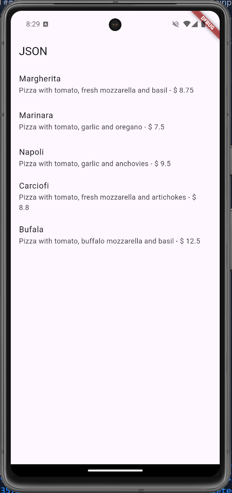

# #14 | RESTFUL API

## A. Praktikum 1, Designing an HTTP client and getting data
### Mendaftarlah ke layanan Lab Mock di https://app.wiremock.cloud/. Bisa anda gunakan akun google untuk mendaftar. Jika berhasil bendaftar dan login, akan muncul seperti gambar berikut.


### 2. Di halaman dahsboard, klik menu Stubs, kemudian klik entri pertama yaitu “GET a JSON resource”. Anda akan melihat layar yang mirip dengan berikut.


### 3. Klik “Create new stub”. Di kolom sebelah kanan, lengkapi data berikut. Namanya adalah “Pizza List”, kemudian pilih GET dan isi dengan “/pizzalist”. Kemudian, pada bagian Response, untuk status 200, kemudian pada Body pilih JSON sebagai formatnya dan isi konten JSON dari https://bit.ly/pizzalist. Perhatikan gambar berikut.


### 4. Tekan tombol SAVE di bagian bawah halaman untuk menyimpan Mock ini. Jika berhasil tersimpan, maka Mock API sudah siap digunakan.

### 5. Buatlah project flutter baru dengan nama pizza_api_nama_anda, tambahkan depedensi “http” melalui terminal.
```bash
flutter pub add http
```

### 6. DI folder “lib” project anda, tambahkan file dengan nama “httphelper.dart”.


### 7. Isi httphelper.dart dengan kode berikut. Ubah “02z2g.mocklab.io” dengan URL Mock API anda.
```dart
import 'dart:io';
import 'package:http/http.dart' as http;
import 'dart:convert';
import 'pizza.dart';

class HttpHelper {
  final String authority = '80gd9.wiremockapi.cloud';
  final String path = 'pizzalist';

  Future<List<Pizza>> getPizzaList() async {
    final Uri uri = Uri.https(authority, path);
    final http.Response result = await http.get(uri);

    if (result.statusCode == HttpStatus.ok) {
      final jsonResponse = json.decode(result.body);
      List<Pizza> pizzas =
          jsonResponse.map<Pizza>((i) => Pizza.fromJson(i)).toList();
      return pizzas;
    } else {
      return [];
    }
  }
}
```

### 8. Di file “main.dart”, di class _ MyHomePageState, tambahkan metode bernama “callPizzas”. Metode ini mengembalikan sebuah Future dari daftar objek Pizza dengan memanggil metode getPizzaList dari kelas HttpHelper, dengan kode sebagai berikut:
```dart
Future<List<Pizza>> callPizzas() async {
    HttpHelper helper = HttpHelper();
    List<Pizza> pizzas = await helper.getPizzaList();
    return pizzas;
}
```

### 9. Pada metode build di class _MyHomePageState, di dalam body Scaffold, tambahkan FutureBuilder yang membuat ListView dari widget ListTile yang berisi objek Pizza:
```dart
class _MyHomePageState extends State<MyHomePage> {
  Future<List<Pizza>> callPizzas() async {
    HttpHelper helper = HttpHelper();
    List<Pizza> pizzas = await helper.getPizzaList();
    return pizzas;
  }

  @override
  Widget build(BuildContext context) {
    return Scaffold(
      appBar: AppBar(
        title: const Text('JSON'),
      ),
      body: FutureBuilder(
        future: callPizzas(),
        builder: (BuildContext context, AsyncSnapshot<List<Pizza>> snapshot) {
          if (snapshot.hasError) {
            return const Text('Something went wrong');
          }
          if (!snapshot.hasData) {
            return const CircularProgressIndicator();
          }
          return ListView.builder(
            itemCount: (snapshot.data == null) ? 0 : snapshot.data!.length,
            itemBuilder: (BuildContext context, int index) {
              return ListTile(
                title: Text(snapshot.data![index].pizzaName),
                subtitle: Text('${snapshot.data![index].description} - \$ ${snapshot.data![index].price}'),
              );
            },
          );
        },
      ),
    );
  }
}
```

### 10. Jalankan aplikasi. Anda akan melihat layar yang mirip dengan berikut ini:
