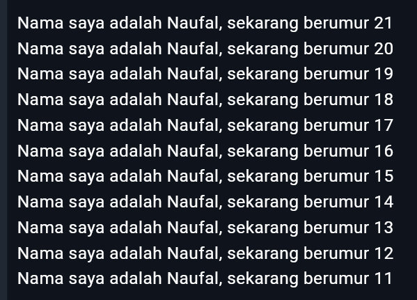

# Praktikum Week - 2
## Soal 1
```dart
void main() {
  for (int i = 21; i > 10; i--) {
    print('Nama saya adalah Naufal, sekarang berumur $i');
  }
}
```
Hasil

## Soal 2
Mengapa sangat penting untuk memahami bahasa pemrograman Dart sebelum kita menggunakan framework Flutter ? Jelaskan!
> Karrena framework Flutter berdasar pada bahasa pemrograman dart.
## Soal 3
Rangkumlah materi dari codelab ini menjadi poin-poin penting yang dapat Anda gunakan untuk membantu proses pengembangan aplikasi mobile menggunakan framework Flutter.
> Jawaban pada Dokumen berikut [Jawaban_Soal_3](Muhammad%20Naufal%20Kurniawan%20-%20Soal%203%20-%20Week2.pdf)