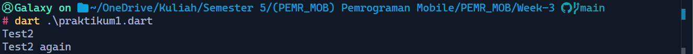
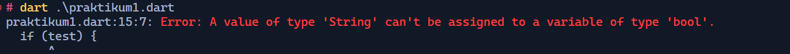
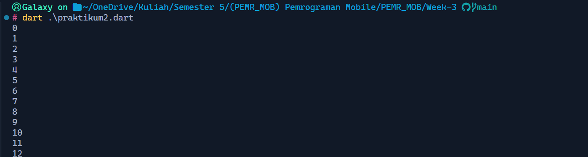
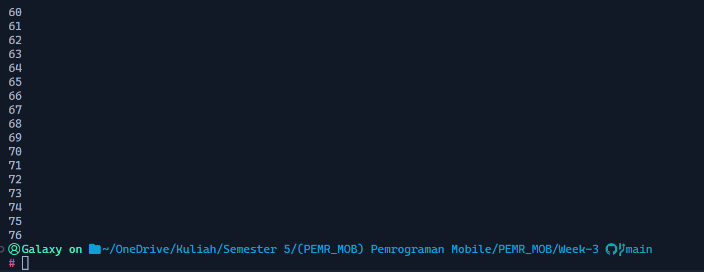
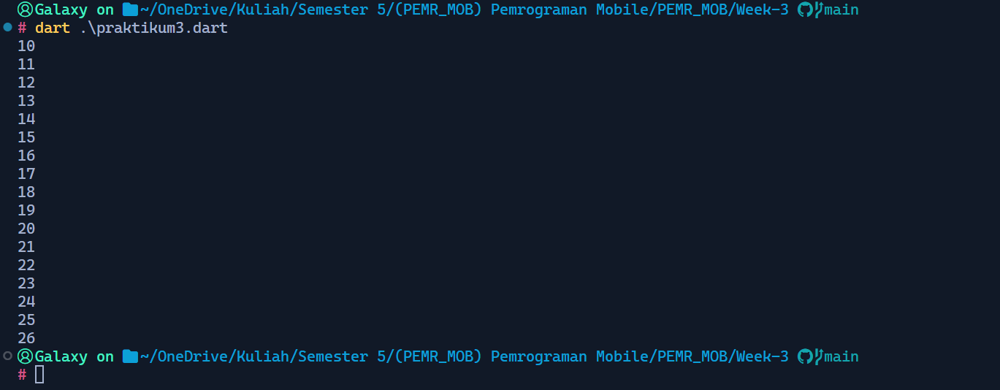
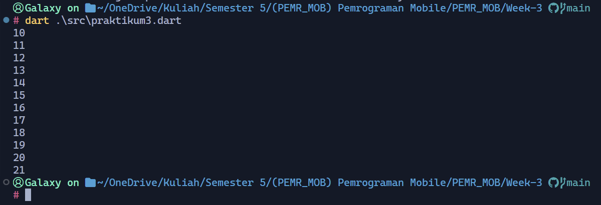

Nama  : Muhammad Naufal Kurniawan
Kelas : TI-3C (18)
NIM   : 2241720214

# Praktikum 1: Menerapkan Control Flows ("if/else")

## Langkah 1
Kode program:
```dart
void main() {
  String test = "test2";

  if (test == "test1") {
    print("Test1");
  } else if (test == "test2") {
    print("Test2");
  } else {
    print("Something else");
  }

  if (test == "test2") print("Test2 again");
}
```

## Langkah 2
Silakan coba eksekusi (Run) kode pada langkah 1 tersebut. Apa yang terjadi? Jelaskan!
Hasil eksekusi:

> Hasilnya program akan mencetak string `Text2` karena program akan mencetak string  berdasarkan isi dari variabel `test`, dimana isi dari variabel `test` program diatas adalah `test2`.

## Langkah 3
Tambahkan kode program berikut, lalu coba eksekusi (Run) kode Anda.
```dart
String test = "true";
if (test) {
   print("Kebenaran");
}
```
Apa yang terjadi ? Jika terjadi error, silakan perbaiki namun tetap menggunakan if/else.
Hasil:

> Ketika program dieksekusi terjadi error dikarenakan variable string tidak dapat dianggap sebagai `boolean`. Berikut adalah kode dan hasilnya setelah diperbaiki.
```dart
void main() {
  String test = "true";
  if (test == "true") {
    print("Kebenaran");
  }
}
```
Hasil:


# Praktikum 2: Menerapkan Perulangan "while" dan "do-while"
Selesaikan langkah-langkah praktikum berikut ini menggunakan DartPad di browser Anda.

## Langkah 1:
Ketik atau salin kode program berikut ke dalam fungsi main().
```dart
while (counter < 33) {
  print(counter);
  counter++;
}
```

## Langkah 2:
Silakan coba eksekusi (Run) kode pada langkah 1 tersebut. Apa yang terjadi? Jelaskan! Lalu perbaiki jika terjadi error.
> Kode tersebut akan terjadi error jika dijalankan, hal tersebut terjadi karena variabel `counter` belum dideklarasikan sebelum diakses. Berikut adalah hasil ketika telah diperbaiki:
```dart
void main() {
  int counter = 0;
  while (counter < 33) {
    print(counter);
    counter++;
  }
}
```


## Langkah 3:
Tambahkan kode program berikut, lalu coba eksekusi (Run) kode Anda.
```dart
do {
  print(counter);
  counter++;
} while (counter < 77);
```
Apa yang terjadi ? Jika terjadi error, silakan perbaiki namun tetap menggunakan do-while.
> Hasilnya tidak terjadi error.
```dart
void main() {
  int counter = 0;
  while (counter < 33) {
    print(counter);
    counter++;
  }

  do {
    print(counter);
    counter++;
  } while (counter < 77);
}
```


# Praktikum 3: Menerapkan Perulangan "for" dan "break-continue"
Selesaikan langkah-langkah praktikum berikut ini menggunakan DartPad di browser Anda.

## Langkah 1:
Ketik atau salin kode program berikut ke dalam fungsi main().
```dart
for (Index = 10; index < 27; index) {
  print(Index);
}
```
## Langkah 2:
Silakan coba eksekusi (Run) kode pada langkah 1 tersebut. Apa yang terjadi? Jelaskan! Lalu perbaiki jika terjadi error.
> Kode pada langkah 1 terjadi beberapa error,
> - Nama variabel tidak sesuai `index` dan `Index`
> - Tipe data tidak dideklarasikan pada `Index = 10;`
> - Setelah kedua kesalahan diatas diperbaiki program telah berjalan tanpa error, namum perulangan tersebut tidak pernah berhenti karena variabel `index` belum di-increment di setiap loop.
> Berikut adalah kode dan hasilnya setelah diperbaiki.
```dart
void main() {
  for (int index = 10; index < 27; index++) {
    print(index);
  }
}
```


## Langkah 3:
Tambahkan kode program berikut di dalam for-loop, lalu coba eksekusi (Run) kode Anda.
```dart
If (Index == 21) break;
Else If (index > 1 || index < 7) continue;
print(index);
```
Apa yang terjadi ? Jika terjadi error, silakan perbaiki namun tetap menggunakan for dan break-continue.
> Ketika program dijalankan maka akan terjadi syntax error karena ada penulisan beberapa syntax yang tidak sesuai.
> Berikut adalah hasilnya setelah diperbaiki.
```dart
void main() {
  for (int index = 10; index < 27; index++) {
    print(index);
    if (index == 21) break;
    else if (index > 1 || index < 7) continue;
    print(index);
  }
}
```


# Tugas Praktikum
### Silakan selesaikan Praktikum 1 sampai 3, lalu dokumentasikan berupa screenshot hasil pekerjaan beserta penjelasannya!
> Laporan praktikum 1-3 sudah terlampir diatas
### Buatlah sebuah program yang dapat menampilkan bilangan prima dari angka 0 sampai 201 menggunakan Dart. Ketika bilangan prima ditemukan, maka tampilkan nama lengkap dan NIM Anda.
```dart
void main(){
  int max = 201;
  bool prime = true;

  for (var i = 2; i < max; i++) {
    for (var j = 2; j < i; j++) {
      if (i % j == 0) {
        prime = false;
        break;
      }
    }
    if (prime) print('[$i] is prime number [ Muhammad Naufal Kurniawan - 2241720214 ]');
    prime = true;
  }
}
```
### Kumpulkan berupa link commit repo GitHub pada tautan yang telah disediakan di grup Telegram!