Nama    : Muhammad Naufal Kurniawan<br>
Kelas   : TI-3C [18]<br>
NIM     : 2241720214<br>

# Praktikum 1: Eksperimen Tipe Data List

## Langkah 1:
Ketik atau salin kode program berikut ke dalam void main().
```dart
var list = [1, 2, 3];
assert(list.length == 3);
assert(list[1] == 2);
print(list.length);
print(list[1]);

list[1] = 1;
assert(list[1] == 1);
print(list[1]);
```
## Langkah 2:
Silakan coba eksekusi (Run) kode pada langkah 1 tersebut. Apa yang terjadi? Jelaskan!
> Ketika program dieksekusi program akan mencetak beberapa nilai, yaitu:
> - nilai pertama ialah nilai panjang dari list yang ada
> - berikutnya adalah nilai list pada index ke-1
> - nilai terakhir ialah nilai list pada index ke-1 setelah diperbarui dengan nilai `1`
>
> Berikut hasil screenshot eksekusi kode:
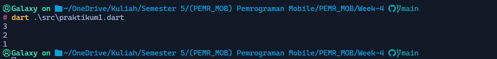


## Langkah 3:
Ubah kode pada langkah 1 menjadi variabel final yang mempunyai index = 5 dengan default value = null. Isilah nama dan NIM Anda pada elemen index ke-1 dan ke-2. Lalu print dan capture hasilnya.

Apa yang terjadi ? Jika terjadi error, silakan perbaiki.
> Berikut adalah kode dan hasilnya
```dart
void main() {
  final list = ['Muhammad Naufal Kurniawan', '2241720214', 1, 2, 3];
  assert(list.length == 5);
  assert(list[1] == 2);
  print(list.length);
  print(list[1]);

  list[1] = 1;
  assert(list[1] == 1);
  print(list[1]);
}
```
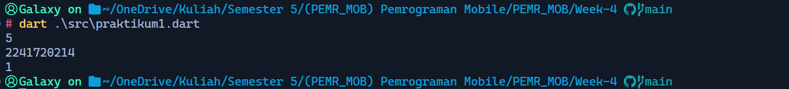


# Praktikum 2: Eksperimen Tipe Data Set
Selesaikan langkah-langkah praktikum berikut ini menggunakan VS Code atau Code Editor favorit Anda.

## Langkah 1:
Ketik atau salin kode program berikut ke dalam fungsi main().
```dart
var halogens = {'fluorine', 'chlorine', 'bromine', 'iodine', 'astatine'};
print(halogens);
```

## Langkah 2:
Silakan coba eksekusi (Run) kode pada langkah 1 tersebut. Apa yang terjadi? Jelaskan! Lalu perbaiki jika terjadi error.
> Program berjalan dengan semestinya ketika diekseskusi, program akan mencetak semua nilai yang berada pada `set` `halogens`.
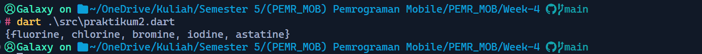

## Langkah 3:
Tambahkan kode program berikut, lalu coba eksekusi (Run) kode Anda.
```dart
var names1 = <String>{};
Set<String> names2 = {}; // This works, too.
var names3 = {}; // Creates a map, not a set.

print(names1);
print(names2);
print(names3);
```
Apa yang terjadi ? Jika terjadi error, silakan perbaiki namun tetap menggunakan ketiga variabel tersebut. Tambahkan elemen nama dan NIM Anda pada kedua variabel Set tersebut dengan dua fungsi berbeda yaitu .add() dan .addAll(). Untuk variabel Map dihapus, nanti kita coba di praktikum selanjutnya.

Dokumentasikan code dan hasil di console, lalu buat laporannya.
> Program berjalan tanpa terjadi error, program mencetak nilai pada langkah 1 dan kemudian pada langkah 3 hanyalah mencetan `set`/`map` kosong. Berikut adalah hasil modifikasi dengan menambahkan `nama` dan `NIM`.
```dart
void main() {
  var halogens = {'fluorine', 'chlorine', 'bromine', 'iodine', 'astatine'};
  print(halogens);

  var names1 = <String>{};
  Set<String> names2 = {}; // This works, too.

  names1.add('2241720214');
  names1.add('Muhammad Naufal Kurniawan');

  names2.addAll({'2241720214', ' Muhammad Naufal Kurniawan'});

  print(names1);
  print(names2);
}
```
> Berikut Hasilnya:
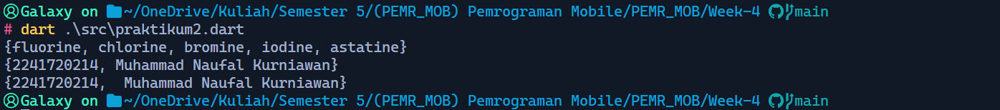


# Praktikum 3: Eksperimen Tipe Data Maps
Selesaikan langkah-langkah praktikum berikut ini menggunakan VS Code atau Code Editor favorit Anda.

## Langkah 1:
Ketik atau salin kode program berikut ke dalam fungsi main().
```dart
var gifts = {
  // Key:    Value
  'first': 'partridge',
  'second': 'turtledoves',
  'fifth': 1
};

var nobleGases = {
  2: 'helium',
  10: 'neon',
  18: 2,
};

print(gifts);
print(nobleGases);
```
## Langkah 2:
Silakan coba eksekusi (Run) kode pada langkah 1 tersebut. Apa yang terjadi? Jelaskan! Lalu perbaiki jika terjadi error.
> Program berjalan dengan semestinya yaitu mencetak semua nilai pada kedua map yang ada.
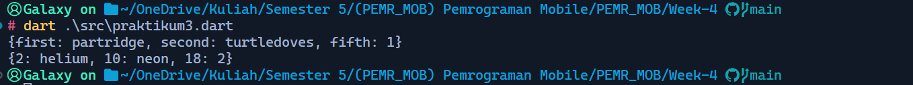

## Langkah 3:
Tambahkan kode program berikut, lalu coba eksekusi (Run) kode Anda.
```dart
var mhs1 = Map<String, String>();
gifts['first'] = 'partridge';
gifts['second'] = 'turtledoves';
gifts['fifth'] = 'golden rings';

var mhs2 = Map<int, String>();
nobleGases[2] = 'helium';
nobleGases[10] = 'neon';
nobleGases[18] = 'argon';
```
Apa yang terjadi ? Jika terjadi error, silakan perbaiki.
> Program berjalan tanpa terjadi error, program mencetak kedua map dengan isi yang telah dimodifikasi.
```dart
void main() {
  var gifts = {
    // Key:    Value
    'first': 'partridge',
    'second': 'turtledoves',
    'fifth': 1
  };

  var nobleGases = {
    2: 'helium',
    10: 'neon',
    18: 2,
  };

  var mhs1 = Map<String, String>();
  gifts['first'] = 'partridge';
  gifts['second'] = 'turtledoves';
  gifts['fifth'] = 'golden rings';

  var mhs2 = Map<int, String>();
  nobleGases[2] = 'helium';
  nobleGases[10] = 'neon';
  nobleGases[18] = 'argon';

  print(gifts);
  print(nobleGases);
}
```
> Screenshot:
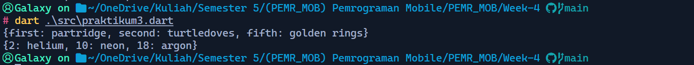

Tambahkan elemen nama dan NIM Anda pada tiap variabel di atas (gifts, nobleGases, mhs1, dan mhs2). Dokumentasikan hasilnya dan buat laporannya!
> Berikut adalah kode programnya.
```dart
void main() {
  var gifts = {
    // Key:    Value
    'first': 'partridge',
    'second': 'turtledoves',
    'fifth': 1
  };

  var nobleGases = {
    2: 'helium',
    10: 'neon',
    18: 2,
  };

  var mhs1 = Map<String, String>();
  gifts['first'] = 'partridge';
  gifts['second'] = 'turtledoves';
  gifts['fifth'] = 'golden rings';

  var mhs2 = Map<int, String>();
  nobleGases[2] = 'helium';
  nobleGases[10] = 'neon';
  nobleGases[18] = 'argon';

  gifts['nim'] = '2241720214';
  gifts['nama'] = 'Muhammad Naufal Kurniawan';

  nobleGases[18] = '2241720214';
  nobleGases[28] = 'Muhammad Naufal Kurniawan';

  mhs1['nim'] = '2241720214';
  mhs1['nama'] = 'Muhammad Naufal Kurniawan';

  mhs2[18] = '2241720214';
  mhs2[28] = 'Muhammad Naufal Kurniawan';

  print(gifts);
  print(nobleGases);
  print(mhs1);
  print(mhs2);
}
```
> Berikut adalah hasil eksekusinya.
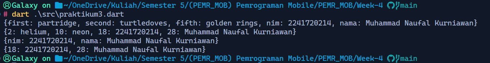
> Pada program diatas terdapat map yang hanya menerima key dengan tipe data tertentu.

# Praktikum 4: Eksperimen Tipe Data List: Spread dan Control-flow Operators
Selesaikan langkah-langkah praktikum berikut ini menggunakan VS Code atau Code Editor favorit Anda.

## Langkah 1:
Ketik atau salin kode program berikut ke dalam fungsi main().
```dart
var list = [1, 2, 3];
var list2 = [0, ...list];
print(list1);
print(list2);
print(list2.length);
```
## Langkah 2:
Silakan coba eksekusi (Run) kode pada langkah 1 tersebut. Apa yang terjadi? Jelaskan! Lalu perbaiki jika terjadi error.
> Terjadi error ketika program dijalankan dikarenakan variabel `list1` diakses namun tidak pernah dideklarasikan.
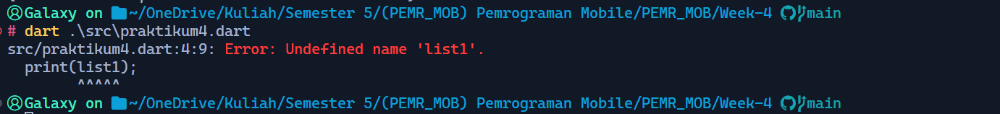
> Program dapat diperbaiki dengan menghapus sintaks ```print(list1)```
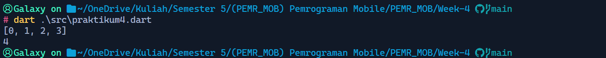

## Langkah 3:
Tambahkan kode program berikut, lalu coba eksekusi (Run) kode Anda.
```dart
list1 = [1, 2, null];
print(list1);
var list3 = [0, ...?list1];
print(list3.length);
```
Apa yang terjadi ? Jika terjadi error, silakan perbaiki.
> Terjadi error karena `Setter` `list1` tidak diatur.
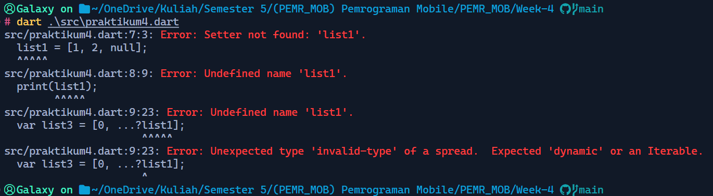

> Bisa diperbaiki seperti berikut.
```dart
// Before
list1 = [1, 2, null];
// After
var list1 = [1, 2, null];
```
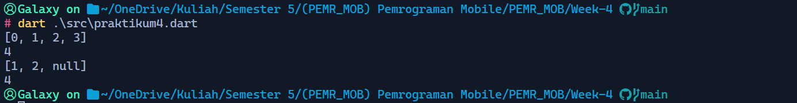

Tambahkan variabel list berisi NIM Anda menggunakan Spread Operators. Dokumentasikan hasilnya dan buat laporannya!
```dart
void main() {
  var list = [1, 2, 3];
  var list2 = [0, ...list];
  print(list2);
  print(list2.length);

  var list1 = [1, 2, null];
  print(list1);
  var list3 = [0, ...?list1];
  print(list3.length);

  var mhs = ['2241720214', 'Muhammad Naufal Kurniawan'];
  var list4 = [0, ...mhs];
  print(list4);
}
```
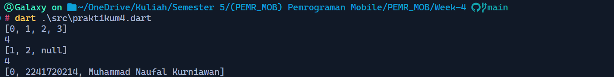

## Langkah 4:
Tambahkan kode program berikut, lalu coba eksekusi (Run) kode Anda.
```dart
var nav = ['Home', 'Furniture', 'Plants', if (promoActive) 'Outlet'];
print(nav);
```
Apa yang terjadi ? Jika terjadi error, silakan perbaiki. Tunjukkan hasilnya jika variabel promoActive ketika true dan false.
> Kode diatas tidak lengkap, untuk dapat menjalankan program dengan semestinya diperlukan deklarasi variabel `boolean` `promoActive`.
```dart
void main() {
  var list = [1, 2, 3];
  var list2 = [0, ...list];
  print(list2);
  print(list2.length);

  var list1 = [1, 2, null];
  print(list1);
  var list3 = [0, ...?list1];
  print(list3.length);

  var mhs = ['2241720214', 'Muhammad Naufal Kurniawan'];
  var list4 = [0, ...mhs];
  print(list4);

  bool promoActive = false; // true or false
  var nav = ['Home', 'Furniture', 'Plants', if (promoActive) 'Outlet'];
  print(nav);
}
```
> Barikut hasilnya dengan kondisi promoActive `false`
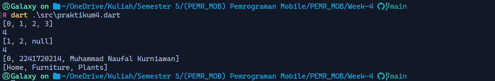
> Berikut Hasilnya dengan kondisi promoActive `true`
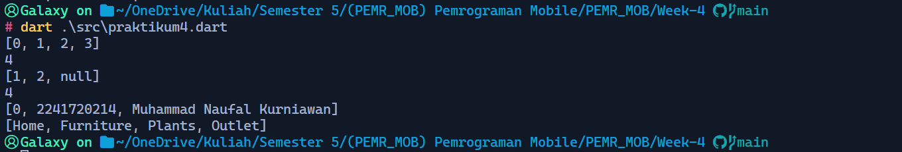
> Hasilnya ketiika kondisi if terpenuhi maka `Outlet` akan dimasukan pada list.

## Langkah 5:
Tambahkan kode program berikut, lalu coba eksekusi (Run) kode Anda.
```dart
var nav2 = ['Home', 'Furniture', 'Plants', if (login case 'Manager') 'Inventory'];
print(nav2);
```
Apa yang terjadi ? Jika terjadi error, silakan perbaiki. Tunjukkan hasilnya jika variabel login mempunyai kondisi lain.
> Sama seperti langkah 4, perlu ditambahkan sebuah variabel yang diakses oleh `if`. Berikut adalah hasilnya jika variabel login mempunyai kondisi selain `Manager`.
```dart
void main() {
  var list = [1, 2, 3];
  var list2 = [0, ...list];
  print(list2);
  print(list2.length);

  var list1 = [1, 2, null];
  print(list1);
  var list3 = [0, ...?list1];
  print(list3.length);

  var mhs = ['2241720214', 'Muhammad Naufal Kurniawan'];
  var list4 = [0, ...mhs];
  print(list4);

  bool promoActive = true; // true or false
  var nav = ['Home', 'Furniture', 'Plants', if (promoActive) 'Outlet'];
  print(nav);

  String login = 'Employee';
  var nav2 = ['Home', 'Furniture', 'Plants', if (login case 'Manager') 'Inventory'];
  print(nav2);
}
```
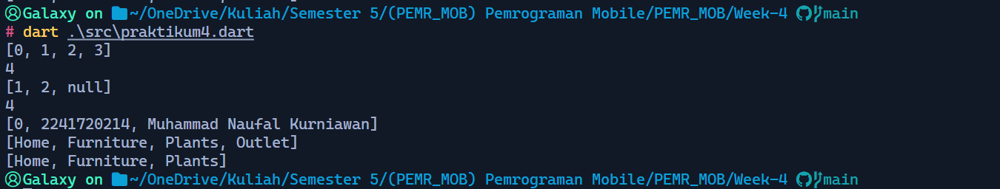

## Langkah 6:
Tambahkan kode program berikut, lalu coba eksekusi (Run) kode Anda.
```dart
var listOfInts = [1, 2, 3];
var listOfStrings = ['#0', for (var i in listOfInts) '#$i'];
assert(listOfStrings[1] == '#1');
print(listOfStrings);
```
Apa yang terjadi ? Jika terjadi error, silakan perbaiki. Jelaskan manfaat Collection For dan dokumentasikan hasilnya.
> Tidak terjadi error. Manfaat dari `Collection For` adalah efisiensi, kita tidak perlu menuliskan list secara langsung jika dapat dilakukan dengan perulangan.
```dart
void main() {
  var list = [1, 2, 3];
  var list2 = [0, ...list];
  print(list2);
  print(list2.length);

  var list1 = [1, 2, null];
  print(list1);
  var list3 = [0, ...?list1];
  print(list3.length);

  var mhs = ['2241720214', 'Muhammad Naufal Kurniawan'];
  var list4 = [0, ...mhs];
  print(list4);

  bool promoActive = true; // true or false
  var nav = ['Home', 'Furniture', 'Plants', if (promoActive) 'Outlet'];
  print(nav);

  String login = 'Employee';
  var nav2 = ['Home', 'Furniture', 'Plants', if (login case 'Manager') 'Inventory'];
  print(nav2);

  var listOfInts = [1, 2, 3];
  var listOfStrings = ['#0', for (var i in listOfInts) '#$i'];
  assert(listOfStrings[1] == '#1');
  print(listOfStrings);
}
```
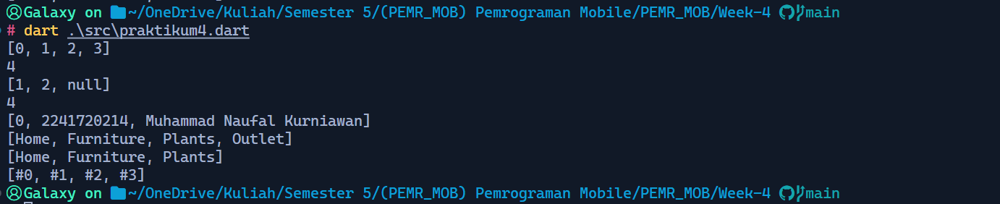


# Praktikum 5: Eksperimen Tipe Data Records
Selesaikan langkah-langkah praktikum berikut ini menggunakan VS Code atau Code Editor favorit Anda.

## Langkah 1:
Ketik atau salin kode program berikut ke dalam fungsi main().
```dart
var record = ('first', a: 2, b: true, 'last');
print(record)
```

## Langkah 2:
Silakan coba eksekusi (Run) kode pada langkah 1 tersebut. Apa yang terjadi? Jelaskan! Lalu perbaiki jika terjadi error.
> Hasilnya terjadi error karena kurangnya sintaks `titik koma` pada baris ``pirnt(record)``. Berikut adalah hasil setelah diperbaiki.
```dart
void main(){
  var record = ('first', a: 2, b: true, 'last');
  print(record);
}
```
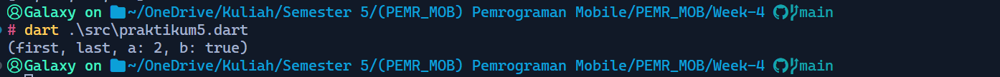

## Langkah 3:
Tambahkan kode program berikut di luar scope void main(), lalu coba eksekusi (Run) kode Anda.
```dart
(int, int) tukar((int, int) record) {
  var (a, b) = record;
  return (b, a);
}
```
Apa yang terjadi ? Jika terjadi error, silakan perbaiki.
> Hasilnya tidak ada perbedaan dengan langkah sebelumnya karena langkah diatas hanyalah menambahkan sebuah fungsi namum tidak pernah digunakan.

Gunakan fungsi tukar() di dalam main() sehingga tampak jelas proses pertukaran value field di dalam Records.
> Berikut hasilnya.
```dart
void main(){
  var record = ('first', a: 2, b: true, 'last');
  print(record);

  var record1 = (18, 28);
  print(record1);
  record1 = tukar(record1);
  print(record1);
}

(int, int) tukar((int, int) record) {
  var (a, b) = record;
  return (b, a);
}
```
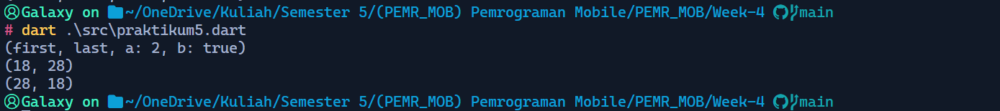

## Langkah 4:
Tambahkan kode program berikut di dalam scope void main(), lalu coba eksekusi (Run) kode Anda.
```dart
// Record type annotation in a variable declaration:
(String, int) mahasiswa;
print(mahasiswa);
```
Apa yang terjadi ? Jika terjadi error, silakan perbaiki.
> Terjadi error ketika dijalankan karena variabel `mahasiswa` hanya dideklarasikan namun tidak diberi nilai.
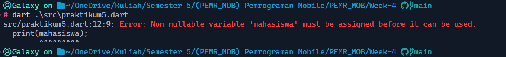

Inisialisasi field nama dan NIM Anda pada variabel record mahasiswa di atas. Dokumentasikan hasilnya dan buat laporannya!
```dart
void main(){
  var record = ('first', a: 2, b: true, 'last');
  print(record);

  var record1 = (18, 28);
  print(record1);
  record1 = tukar(record1);
  print(record1);

  // Record type annotation in a variable declaration:
  (String, int) mahasiswa = ('Muhammad Naufal Kurniawan', 2241720214);
  print(mahasiswa);
}

(int, int) tukar((int, int) record) {
  var (a, b) = record;
  return (b, a);
}
```
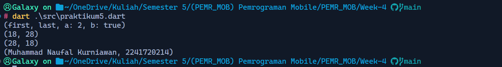

## Langkah 5:
Tambahkan kode program berikut di dalam scope void main(), lalu coba eksekusi (Run) kode Anda.
```dart
var mahasiswa2 = ('first', a: 2, b: true, 'last');

print(mahasiswa2.$1); // Prints 'first'
print(mahasiswa2.a); // Prints 2
print(mahasiswa2.b); // Prints true
print(mahasiswa2.$2); // Prints 'last'
```
Apa yang terjadi ? Jika terjadi error, silakan perbaiki.
> Hasilnya berjalan dengan semestinya, tidak terjadi error.
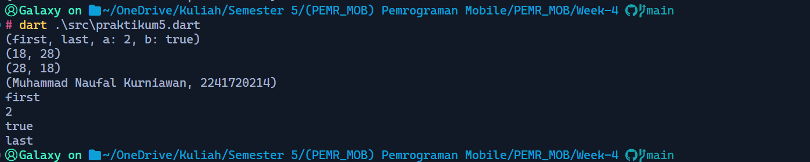

Gantilah salah satu isi record dengan nama dan NIM Anda, lalu dokumentasikan hasilnya dan buat laporannya!
```dart
void main(){
  var record = ('first', a: 2, b: true, 'last');
  print(record);

  var record1 = (18, 28);
  print(record1);
  record1 = tukar(record1);
  print(record1);

  // Record type annotation in a variable declaration:
  (String, int) mahasiswa = ('Muhammad Naufal Kurniawan', 2241720214);
  print(mahasiswa);

  var mahasiswa2 = ('first', a: 2241720214, b: 'Muhammad Naufal Kurniawan', 'last');

  print(mahasiswa2.$1); // Prints 'first'
  print(mahasiswa2.a); // Prints 2
  print(mahasiswa2.b); // Prints true
  print(mahasiswa2.$2); // Prints 'last'
}

(int, int) tukar((int, int) record) {
  var (a, b) = record;
  return (b, a);
}
```
> Screenshot:
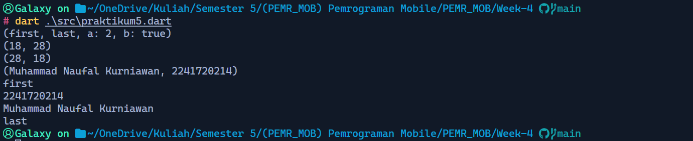

# Tugas Praktikum
1. Silakan selesaikan Praktikum 1 sampai 5, lalu dokumentasikan berupa screenshot hasil pekerjaan Anda beserta penjelasannya!
    > Sudah terlampir diatas.
2. Jelaskan yang dimaksud Functions dalam bahasa Dart!
    > Fungsi adalah kumpulan kode yang memiliki sebuah tujuan tertentu yang berguna untuk efisiensi kode dan agar kode mudah dibaca.
3. Jelaskan jenis-jenis parameter di Functions beserta contoh sintaksnya!
    > - Positional Parameters: Parameter ini dikirimkan berdasarkan urutan. ```void greet(String name, int age)```
    > - Optional Positional Parameters: Parameter opsional yang bisa dilewatkan saat pemanggilan fungsi. Gunakan tanda []. ```void greet(String name, [int? age])```
    > - Named Parameters: Parameter yang disertakan dengan nama saat dipanggil. Gunakan {}. ```void greet({required String name, int age = 18})```
    > - Default Parameters: Parameter dengan nilai default yang diberikan jika tidak ada argumen yang dikirim. ```void greet({String name = "Anonymous", int age = 18})```
4. Jelaskan maksud Functions sebagai first-class objects beserta contoh sintaknya!
    > Fungsi dalam bahasa pemrograman Dart adalah "first-class objects", artinya mereka bisa diperlakukan seperti objek lain. Ini berarti fungsi dapat disimpan dalam variabel, dilewatkan sebagai argumen ke fungsi lain, atau dikembalikan oleh fungsi.
5. Apa itu Anonymous Functions? Jelaskan dan berikan contohnya!
    > Anonymous functions (fungsi tanpa nama) adalah fungsi yang tidak diberikan nama, sering digunakan ketika sebuah fungsi hanya digunakan satu kali atau langsung sebagai argumen.
6. Jelaskan perbedaan Lexical scope dan Lexical closures! Berikan contohnya!
    > Lexical scope berarti variabel yang dideklarasikan dalam sebuah fungsi hanya bisa diakses di dalam fungsi tersebut, dan variabel luar bisa diakses oleh fungsi dalam. Lexical Closure adalah fungsi yang "mengikat" variabel dari lingkup luar meskipun lingkup tersebut sudah selesai dieksekusi.
7. Jelaskan dengan contoh cara membuat return multiple value di Functions!
    > Dapat dilakukan menggunakan tuple ```return (18, "Naufal");```
8. Kumpulkan berupa link commit repo GitHub pada tautan yang telah disediakan di grup Telegram!