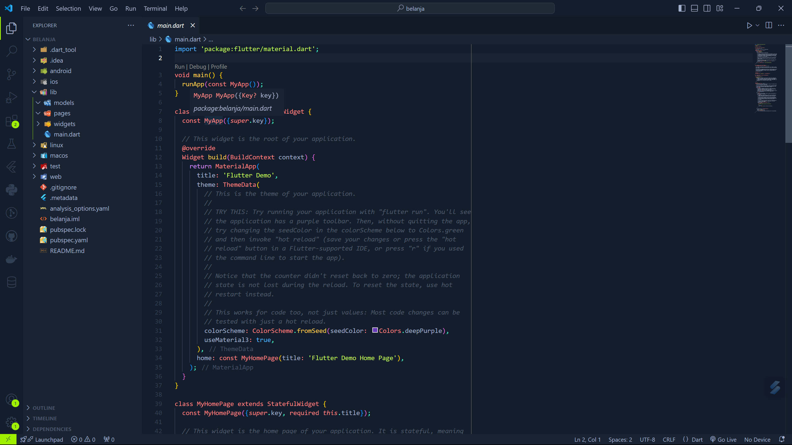

# #06 | Layout dan Navigasi

## Praktikum 1: Membangun Layout di Flutter
### Langkah 1: Buat Projek Baru
Membuat projek `layout_flutter`


### Langkah 2: Buka file lib/main.dart
Ubah file main.dart seperti berikut:
```dart
import 'package:flutter/material.dart';

void main() => runApp(const MyApp());

class MyApp extends StatelessWidget {
  const MyApp({super.key});

  @override
  Widget build(BuildContext context) {
    return MaterialApp(
      title: 'Flutter layout: Muhammad Naufal Kurniawan dan 2241720214 Anda',
      home: Scaffold(
        appBar: AppBar(
          title: const Text('Flutter layout demo'),
        ),
        body: const Center(
          child: Text('Hello World'),
        ),
      ),
    );
  }
}
```
Result:


### Langkah 3: Identifikasi layout diagram
Langkah pertama adalah memecah tata letak menjadi elemen dasarnya:
- Identifikasi baris dan kolom.
- Apakah tata letaknya menyertakan kisi-kisi (grid)?
- Apakah ada elemen yang tumpang tindih?
- Apakah UI memerlukan tab?
- Perhatikan area yang memerlukan alignment, padding, atau borders.

### Langkah 4: Implementasi title row
Membuat kolom bagian kiri pada judul. Berikut adalah kode pada file `main.dart`:
```dart
import 'package:flutter/material.dart';

void main() => runApp(MyApp());

// ignore: must_be_immutable
class MyApp extends StatelessWidget {
  MyApp({super.key});

  Widget titleSection = Container(
    padding: const EdgeInsets.all(32),
    child: Row(
      children: [
        Expanded(
          /* soal 1*/
          child: Column(
            crossAxisAlignment: CrossAxisAlignment.start,
            children: [
              /* soal 2*/
              Container(
                padding: const EdgeInsets.only(bottom: 8),
                child: const Text(
                  'Wisata Gunung di Batu',
                  style: TextStyle(
                    fontWeight: FontWeight.bold,
                  ),
                ),
              ),
              const Text(
                'Batu, Malang, Indonesia',
                style: TextStyle(color: Color(0xffa8acb3)),
              ),
            ],
          ),
        ),
        /* soal 3*/
        const Icon(
          Icons.star_border,
          color: Color(0xffFF0000),
        ),
        const Text('41'),
      ],
    ),
  );

  @override
  Widget build(BuildContext context) {
    return MaterialApp(
      title: 'Flutter layout: Muhammad Naufal Kurniawan dan 2241720214 Anda',
      home: Scaffold(
        appBar: AppBar(
          title: const Text('Flutter layout demo'),
        ),
        body: Column(
          children: [
            titleSection,
          ],
        )
      ),
    );
  }
}
```

Result:


## Praktikum 2: Implementasi button row
### Langkah 1: Buat method Column _buildButtonColumn
Bagian tombol berisi 3 kolom yang menggunakan tata letak yang sama—sebuah ikon di atas baris teks. Kolom pada baris ini diberi jarak yang sama, dan teks serta ikon diberi warna primer.

Karena kode untuk membangun setiap kolom hampir sama, buatlah metode pembantu pribadi bernama `buildButtonColumn()`, yang mempunyai parameter warna, Icon dan Text, sehingga dapat mengembalikan kolom dengan widgetnya sesuai dengan warna tertentu.

File `lib/main.dart`:
```dart
class MyApp extends StatelessWidget {
  const MyApp({super.key});

  @override
  Widget build(BuildContext context) {
    // ···
  }

  Column _buildButtonColumn(Color color, IconData icon, String label) {
    return Column(
      mainAxisSize: MainAxisSize.min,
      mainAxisAlignment: MainAxisAlignment.center,
      children: [
        Icon(icon, color: color),
        Container(
          margin: const EdgeInsets.only(top: 8),
          child: Text(
            label,
            style: TextStyle(
              fontSize: 12,
              fontWeight: FontWeight.w400,
              color: color,
            ),
          ),
        ),
      ],
    );
  }
}
```

### Langkah 2: Buat widget buttonSection
Buat Fungsi untuk menambahkan ikon langsung ke kolom. Teks berada di dalam Container dengan margin hanya di bagian atas, yang memisahkan teks dari ikon.

Bangun baris yang berisi kolom-kolom ini dengan memanggil fungsi dan set warna, Icon, dan teks khusus melalui parameter ke kolom tersebut. Sejajarkan kolom di sepanjang sumbu utama menggunakan MainAxisAlignment.spaceEvenly untuk mengatur ruang kosong secara merata sebelum, di antara, dan setelah setiap kolom. Tambahkan kode berikut tepat di bawah deklarasi titleSection di dalam metode build():

`lib/main.dart` (`buttonSection`)
```dart
Color color = Theme.of(context).primaryColor;

Widget buttonSection = Row(
  mainAxisAlignment: MainAxisAlignment.spaceEvenly,
  children: [
    _buildButtonColumn(color, Icons.call, 'CALL'),
    _buildButtonColumn(color, Icons.near_me, 'ROUTE'),
    _buildButtonColumn(color, Icons.share, 'SHARE'),
  ],
);
```
### Langkah 3: Tambah button section ke body
Tambahkan variabel buttonSection ke dalam body seperti berikut:
```dart
return MaterialApp(
    title: "Flutter layout demo",
    home: Scaffold(
    body: Column(
        children: [
        titleSection,
        buttonSection,
        ],
    ),
    ),
);
```
Berikut hasil akhir file `main.dart`
```dart
import 'package:flutter/material.dart';

void main() => runApp(MyApp());

// ignore: must_be_immutable
class MyApp extends StatelessWidget {
  MyApp({super.key});

  Widget titleSection = Container(
    padding: const EdgeInsets.all(32),
    child: Row(
      children: [
        Expanded(
          /* soal 1*/
          child: Column(
            crossAxisAlignment: CrossAxisAlignment.start,
            children: [
              /* soal 2*/
              Container(
                padding: const EdgeInsets.only(bottom: 8),
                child: const Text(
                  'Wisata Gunung di Batu',
                  style: TextStyle(
                    fontWeight: FontWeight.bold,
                  ),
                ),
              ),
              const Text(
                'Batu, Malang, Indonesia',
                style: TextStyle(color: Color(0xffa8acb3)),
              ),
            ],
          ),
        ),
        /* soal 3*/
        const Icon(
          Icons.star_border,
          color: Color(0xffFF0000),
        ),
        const Text('41'),
      ],
    ),
  );

  @override
  Widget build(BuildContext context) {
    Color color = Theme.of(context).primaryColor;

    Widget buttonSection = Row(
      mainAxisAlignment: MainAxisAlignment.spaceEvenly,
      children: [
        _buildButtonColumn(color, Icons.call, 'CALL'),
        _buildButtonColumn(color, Icons.near_me, 'ROUTE'),
        _buildButtonColumn(color, Icons.share, 'SHARE'),
      ],
    );

    return MaterialApp(
      title: "Flutter layout demo",
      home: Scaffold(
        body: Column(
          children: [
            titleSection,
            buttonSection,
          ],
        ),
      ),
    );
  }

  Column _buildButtonColumn(Color color, IconData icon, String label) {
    return Column(
      mainAxisSize: MainAxisSize.min,
      mainAxisAlignment: MainAxisAlignment.center,
      children: [
        Icon(icon, color: color),
        Container(
          margin: const EdgeInsets.only(top: 8),
          child: Text(
            label,
            style: TextStyle(
              fontSize: 12,
              fontWeight: FontWeight.w400,
              color: color,
            ),
          ),
        ),
      ],
    );
  }
}
```

Result:


## Praktikum 3: Implementasi text section
### Langkah 1: Buat widget textSection
Tentukan bagian teks sebagai variabel. Masukkan teks ke dalam Container dan tambahkan padding di sepanjang setiap tepinya. Tambahkan kode berikut tepat di bawah deklarasi `buttonSection`:
```dart
Widget textSection = Container(
  padding: const EdgeInsets.all(32),
  child: const Text(
    'Carilah teks di internet yang sesuai '
    'dengan foto atau tempat wisata yang ingin '
    'Anda tampilkan. '
    'Tambahkan nama dan NIM Anda sebagai '
    'identitas hasil pekerjaan Anda. '
    'Selamat mengerjakan 🙂.',
    softWrap: true,
  ),
);
```

### Langkah 2: Tambahkan variabel text section ke body
Tambahkan widget variabel `textSection` ke dalam body seperti berikut:
```dart
return MaterialApp(
    title: "Flutter layout demo",
    home: Scaffold(
    body: Column(
        children: [
        titleSection,
        buttonSection,
        textSection
        ],
    ),
    ),
);
```

Hasil:


## Praktikum 4: Implementasi image section
### Langkah 1: Siapkan aset gambar
```yaml
# The following section is specific to Flutter packages.
flutter:

  # The following line ensures that the Material Icons font is
  # included with your application, so that you can use the icons in
  # the material Icons class.
  uses-material-design: true

  # To add assets to your application, add an assets section, like this:
  assets:
    - images/bromo.jpg
```

### Langkah 2: Tambahkan gambar ke body
Tambahkan aset gambar ke dalam `body` seperti berikut:
```dart
return MaterialApp(
    title: "Flutter layout demo",
    home: Scaffold(
    body: Column(
        children: [
        Image.asset(
            'image/bromo.jpg',
            width: 600,
            height: 240,
            fit: BoxFit.cover,
        ),
        titleSection,
        buttonSection,
        textSection
        ],
    ),
    ),
);
```

### Langkah 3: Terakhir, ubah menjadi ListView
Ubah layout column menjadi listview
```dart
return MaterialApp(
    title: "Flutter layout demo",
    home: Scaffold(
    body: ListView(
        children: [
        Image.asset(
            'images/bromo.jpg',
            width: 600,
            height: 240,
            fit: BoxFit.cover,
        ),
        titleSection,
        buttonSection,
        textSection
        ],
    ),
    ),
);
```
Berikut hasilnya.


## Praktikum 5: Layout dan Navigasi
### Langkah 1: Siapkan project baru
Membuat project baru dengan nama belanja.

### Langkah 2: Mendefinisikan Route
Buatlah dua buah file dart dengan nama `home_page.dart` dan `item_page.dart` pada folder pages. Untuk masing-masing file, deklarasikan class `HomePage` pada file `home_page.dart` dan `ItemPage` pada `item_page.dart`. Turunkan class dari `StatelessWidget`. Gambaran potongan kode dapat anda lihat sebagai berikut.


Berikut kode untuk setiap page:
- home_page.dart
    ```dart
    import 'package:flutter/material.dart';

    class HomePage extends StatelessWidget{
        @override
        Widget build(BuildContext context) {
            // TODO: implement build
            throw UnimplementedError();
        }
    }
    ```
- item_page.dart
    ```dart
    import 'package:flutter/material.dart';

    class ItemPage extends StatelessWidget {
        @override
        Widget build(BuildContext context) {
            // TODO: implement build
            throw UnimplementedError();
        }
    }
    ```

### Langkah 3: Lengkapi Kode di main.dart
Setelah kedua halaman telah dibuat dan didefinisikan, bukalah file main.dart. Pada langkah ini anda akan mendefinisikan Route untuk kedua halaman tersebut. Definisi penamaan route harus bersifat unique. Halaman HomePage didefinisikan sebagai /. Dan halaman ItemPage didefinisikan sebagai /item. Untuk mendefinisikan halaman awal, anda dapat menggunakan named argument `initialRoute`.

File `main.dart`
```dart
import 'package:belanja/pages/home_page.dart';
import 'package:belanja/pages/item_page.dart';
import 'package:flutter/material.dart';

void main() {
  runApp(MaterialApp(
    initialRoute: '/',
    routes: {
      '/': (context) => HomePage(),
      '/item': (context) => ItemPage(),
    },
  ));
}
```

### Langkah 4: Membuat data model
Sebelum melakukan perpindahan halaman dari `HomePage` ke `ItemPage`, dibutuhkan proses pemodelan data. Pada desain mockup, dibutuhkan dua informasi yaitu nama dan harga. Untuk menangani hal ini, buatlah sebuah file dengan nama `item.dart` dan letakkan pada folder `models`. Pada file ini didefinisikan pemodelan data yang dibutuhkan.

File `models/item.dart`
```dart
class Item {
  String name;
  int price;

  Item({required this.name, required this.price});
}
```

### Langkah 5: Lengkapi kode di class HomePage
Pada halaman `HomePage` terdapat `ListView` widget. Sumber data `ListView` diambil dari model List dari object Item.

File `pages/home_page.dart`
```dart
import 'package:belanja/models/item.dart';
import 'package:flutter/material.dart';

class HomePage extends StatelessWidget {
  final List<Item> items = [
    Item(name: 'Sugar', price: 5000),
    Item(name: 'Salt', price: 2000)
  ];

  @override
  Widget build(BuildContext context) {
    // TODO: implement build
    throw UnimplementedError();
  }
}
```

### Langkah 6: Membuat ListView dan itemBuilder
Untuk menampilkan `ListView` pada praktikum ini digunakan `itemBuilder`. Data diambil dari definisi model yang telah dibuat sebelumnya. Untuk menunjukkan batas data satu dan berikutnya digunakan widget Card. Kode yang telah umum pada bagian ini tidak ditampilkan.

File `pages/home_page.dart`
```dart
import 'package:belanja/models/item.dart';
import 'package:flutter/material.dart';

class HomePage extends StatelessWidget {
  final List<Item> items = [
    Item(name: 'Sugar', price: 5000),
    Item(name: 'Salt', price: 2000)
  ];

  @override
  Widget build(BuildContext context) {
    return MaterialApp(
        title: "Flutter layout demo",
        home: Scaffold(
            body: Container(
          margin: EdgeInsets.all(8),
          child: ListView.builder(
            padding: EdgeInsets.all(8),
            itemCount: items.length,
            itemBuilder: (context, index) {
              final item = items[index];
              return Card(
                child: Container(
                  margin: EdgeInsets.all(8),
                  child: Row(
                    children: [
                      Expanded(child: Text(item.name)),
                      Expanded(
                          child: Text(
                        item.price.toString(),
                        textAlign: TextAlign.end,
                      ))
                    ],
                  ),
                ),
              );
            },
          ),
        )));
  }
}
```

Hasil:


### Langkah 7: Menambahkan aksi pada ListView
```dart
return InkWell(
    onTap: () => Navigator.pushNamed(context, '/item'),
```

Hasil:


## Tugas Praktikum 2
1. Untuk melakukan pengiriman data ke halaman berikutnya, cukup menambahkan informasi arguments pada penggunaan `Navigator`. Perbarui kode pada bagian `Navigator` menjadi seperti berikut.
    ```dart
    Navigator.pushNamed(context, '/item', arguments: item);
    ```

    File `home_page.dart`

    ```dart
        import 'package:belanja/models/item.dart';
        import 'package:flutter/material.dart';

        class HomePage extends StatelessWidget {
        final List<Item> items = [
            Item(name: 'Sugar', price: 5000),
            Item(name: 'Salt', price: 2000),
        ];

        @override
        Widget build(BuildContext context) {
            return Scaffold(
            body: Container(
                margin: EdgeInsets.all(8),
                child: ListView.builder(
                padding: EdgeInsets.all(8),
                itemCount: items.length,
                itemBuilder: (context, index) {
                    final item = items[index];
                    return InkWell(
                    onTap: () {
                        Navigator.pushNamed(context, '/item', arguments: item);
                    },
                    child: Card(
                        child: Container(
                        margin: EdgeInsets.all(8),
                        child: Row(
                            children: [
                            Expanded(child: Text(item.name)),
                            Expanded(
                                child: Text(
                                item.price.toString(),
                                textAlign: TextAlign.end,
                                ),
                            ),
                            ],
                        ),
                        ),
                    ),
                    );
                },
                ),
            ),
            );
        }
    }
    ```
2. Pembacaan nilai yang dikirimkan pada halaman sebelumnya dapat dilakukan menggunakan `ModalRoute`. Tambahkan kode berikut pada blok fungsi build dalam halaman `ItemPage`. Setelah nilai didapatkan, anda dapat menggunakannya seperti penggunaan variabel pada umumnya. (https://docs.flutter.dev/cookbook/navigation/navigate-with-arguments)
    ```dart
    final itemArgs = ModalRoute.of(context)!.settings.arguments as Item;
    ```

    File `item_page.dart`:
    ```dart
    import 'package:belanja/models/item.dart';
    import 'package:flutter/material.dart';

    class ItemPage extends StatelessWidget {
    @override
    Widget build(BuildContext context) {
        final itemArgs = ModalRoute.of(context)!.settings.arguments as Item;
        return Scaffold(
        appBar: AppBar(
            title: Text('Shopping List'),
            backgroundColor: Color(0xff0097f7),
            foregroundColor: Color(0xffffffff),
        ),
        body: Center(
            child: Text('${itemArgs.name} with ${itemArgs.price}'),
        ),
        );
    }
    }
    ```

    Hasil:
    
    

3. Pada hasil akhir dari aplikasi belanja yang telah anda selesaikan, tambahkan atribut foto produk, stok, dan rating. Ubahlah tampilan menjadi GridView seperti di aplikasi marketplace pada umumnya.
Berikut hasil kode:
    File `home_page.dart`

    ```dart
    import 'package:belanja/models/item.dart';
    import 'package:flutter/material.dart';
    import 'package:intl/intl.dart';

    final formatCurrency =
        NumberFormat.currency(locale: 'id', symbol: 'Rp', decimalDigits: 0);

    class HomePage extends StatelessWidget {
      final List<Item> items = [
        Item(
            name: 'Gula Pasir',
            price: 5000,
            image: 'gula.png',
            qty: 24,
            rating: 4.8),
        Item(
            name: 'Garam Dapur',
            price: 2000,
            image: 'garam.jpg',
            qty: 12,
            rating: 4.9),
      ];

      @override
      Widget build(BuildContext context) {
        return Scaffold(
            appBar: AppBar(
              title: const Text('Shopping List'),
              backgroundColor: const Color(0xff0097f7),
              foregroundColor: const Color(0xffffffff),
            ),
            body: GridView.count(
              crossAxisCount: 2,
              childAspectRatio: 0.8,
              children: List.generate(items.length, (index) {
                return InkWell(
                  onTap: () {
                    Navigator.pushNamed(context, '/item', arguments: items[index]);
                  },
                  child: Card(
                    margin: const EdgeInsets.all(10),
                    color: const Color.fromARGB(211, 255, 255, 255),
                    child: Column(
                      children: [
                        ClipRRect(
                          borderRadius: BorderRadius.circular(10.0),
                          child: Image.asset(
                            items[index].image,
                            fit: BoxFit.fitWidth,
                            height: 150,
                          ),
                        ),
                        Expanded(
                          child: Container(
                            padding: const EdgeInsets.all(8),
                            alignment:
                                Alignment.centerLeft,
                            child: Column(
                              crossAxisAlignment: CrossAxisAlignment.start,
                              mainAxisAlignment: MainAxisAlignment
                                  .spaceBetween,
                              children: [
                                Text(items[index].name),
                                Text(
                                  formatCurrency.format(items[index].price),
                                  style:
                                      const TextStyle(fontWeight: FontWeight.bold),
                                ),
                                Expanded(
                                  child: Row(
                                    mainAxisAlignment: MainAxisAlignment
                                        .spaceBetween,
                                    children: [
                                      Row(
                                        children: [
                                          const Icon(
                                            Icons.star,
                                            size: 15,
                                            color: Color(0xffffc400),
                                          ),
                                          const SizedBox(width: 4),
                                          Text(items[index].rating.toString()),
                                        ],
                                      ),
                                      Expanded(
                                        child: Align(
                                          alignment: Alignment.centerRight,
                                          child: Text(
                                              'Stok: ${items[index].qty.toString()}'),
                                        ),
                                      ),
                                    ],
                                  ),
                                ),
                              ],
                            ),
                          ),
                        ),
                      ],
                    ),
                  ),
                );
              }),
            ));
      }
    }
    ```
    File `item_page.dart`
    Hasil:
    

    ```dart
    import 'package:belanja/models/item.dart';
    import 'package:flutter/material.dart';
    import 'package:intl/intl.dart';

    final formatCurrency =
        NumberFormat.currency(locale: 'id', symbol: 'Rp', decimalDigits: 0);

    class ItemPage extends StatelessWidget {
      @override
      Widget build(BuildContext context) {
        final itemArgs = ModalRoute.of(context)!.settings.arguments as Item;
        return Scaffold(
          appBar: AppBar(
            title: const Text('Shopping List'),
            backgroundColor: const Color(0xff0097f7),
            foregroundColor: const Color(0xffffffff),
          ),
          body: Column(
            crossAxisAlignment: CrossAxisAlignment.start,
            children: [
              ClipRect(
                child: Align(
                  alignment: Alignment.center,
                  heightFactor:
                      0.9,
                  child: Image.asset(
                    itemArgs.image,
                    height: 380,
                    fit: BoxFit.fitWidth,
                  ),
                ),
              ),
              Container(
                padding: const EdgeInsets.all(16),
                color: const Color(0xffffffff),
                width: double.infinity,
                child: Column(
                  crossAxisAlignment: CrossAxisAlignment.start,
                  children: [
                    Row(
                      mainAxisAlignment: MainAxisAlignment.spaceBetween,
                      children: [
                        Text(
                          formatCurrency.format(itemArgs.price),
                          style: const TextStyle(
                              fontSize: 20, fontWeight: FontWeight.bold),
                        ),
                        Row(
                          children: [
                            const Icon(
                              Icons.star,
                              size: 18,
                              color: Color(0xffffc400),
                            ),
                            const SizedBox(width: 4),
                            Text(
                              itemArgs.rating.toString(),
                              style: const TextStyle(fontSize: 15),
                            ),
                          ],
                        ),
                      ],
                    ),
                    const SizedBox(
                      height: 8,
                    ),
                    Text(
                      itemArgs.name,
                      style: const TextStyle(fontSize: 18),
                    ),
                    const SizedBox(
                      height: 8,
                    ),
                    Row(
                      mainAxisAlignment: MainAxisAlignment
                          .spaceBetween, // Spread the content evenly
                      children: [
                        Expanded(
                          child: Align(
                            alignment: Alignment.centerLeft,
                            child: Text(
                              'Stok: ${itemArgs.qty.toString()}',
                              style: const TextStyle(fontSize: 16),
                            ),
                          ),
                        ),
                      ],
                    ),
                  ],
                ),
              )
            ],
          ),
        );
      }
    }
    ```
    Hasil:
    

4. Silakan implementasikan Hero widget pada aplikasi belanja Anda dengan mempelajari dari sumber ini: https://docs.flutter.dev/cookbook/navigation/hero-animations
  Image section `home_page.dart`
    ```dart
    ClipRRect(
      borderRadius: BorderRadius.circular(10.0),
      child: Hero(
        tag: 'item_img_${items[index].hashCode}',
        child: Image.asset(
          items[index].image,
          fit: BoxFit.fitWidth,
          height: 150,
        ),
      ),
    ),
    ```
    Image section `item_page.dart`
    ```dart
    ClipRect(
      child: Align(
        alignment: Alignment.center,
        heightFactor: 0.9,
        child: Hero(
          tag: 'item_img_${itemArgs.hashCode}',
          child: Image.asset(
            itemArgs.image,
            height: 380,
            fit: BoxFit.fitWidth,
          ),
        ),
      ),
    ),
    ```
    Result:
    

5. Sesuaikan dan modifikasi tampilan sehingga menjadi aplikasi yang menarik. Selain itu, pecah widget menjadi kode yang lebih kecil. Tambahkan Nama dan NIM di footer aplikasi belanja Anda.
File `home_page.dart`

    ```dart
    import 'package:belanja/models/item.dart';
    import 'package:flutter/material.dart';
    import 'package:intl/intl.dart';

    final formatCurrency =
        NumberFormat.currency(locale: 'id', symbol: 'Rp', decimalDigits: 0);

    class HomePage extends StatelessWidget {
      final List<Item> items = [
        Item(
            name: 'Gula Pasir',
            price: 5000,
            image: 'gula.png',
            qty: 24,
            rating: 4.8),
        Item(
            name: 'Garam Dapur',
            price: 2000,
            image: 'garam.jpg',
            qty: 12,
            rating: 4.9),
      ];

      @override
      Widget build(BuildContext context) {
        return Scaffold(
          appBar: AppBar(
            title: const Text('Shopping List'),
            backgroundColor: const Color(0xff0097f7),
            foregroundColor: const Color(0xffffffff),
          ),
          body: Column(
            children: [
              Expanded(
                child: GridView.count(
                  crossAxisCount: 2,
                  childAspectRatio: 0.8,
                  children: List.generate(items.length, (index) {
                    return itemCard(context, index);
                  }),
                ),
              ),
              footer(),
            ],
          ),
        );
      }

      InkWell itemCard(BuildContext context, int index) {
        var clipRRect = ClipRRect(
          borderRadius: BorderRadius.circular(10.0),
          child: Hero(
            tag: 'item_img_${items[index].hashCode}',
            child: Image.asset(
              items[index].image,
              fit: BoxFit.fitWidth,
              height: 150,
            ),
          ),
        );
        var itemRatingAndStok = Expanded(
          child: Row(
            mainAxisAlignment: MainAxisAlignment.spaceBetween,
            children: [
              Row(
                children: [
                  const Icon(
                    Icons.star,
                    size: 15,
                    color: Color(0xffffc400),
                  ),
                  const SizedBox(width: 4),
                  Text(items[index].rating.toString()),
                ],
              ),
              Expanded(
                child: Align(
                  alignment: Alignment.centerRight,
                  child: Text('Stok: ${items[index].qty.toString()}'),
                ),
              ),
            ],
          ),
        );
        return InkWell(
          onTap: () {
            Navigator.pushNamed(context, '/item', arguments: items[index]);
          },
          child: Card(
            margin: const EdgeInsets.all(10),
            color: const Color.fromARGB(211, 255, 255, 255),
            child: Column(
              children: [
                clipRRect,
                Expanded(
                  child: Container(
                    padding: const EdgeInsets.all(8),
                    alignment: Alignment.centerLeft,
                    child: Column(
                      crossAxisAlignment: CrossAxisAlignment.start,
                      mainAxisAlignment: MainAxisAlignment.spaceBetween,
                      children: [
                        Text(items[index].name),
                        Text(
                          formatCurrency.format(items[index].price),
                          style: const TextStyle(fontWeight: FontWeight.bold),
                        ),
                        itemRatingAndStok,
                      ],
                    ),
                  ),
                ),
              ],
            ),
          ),
        );
      }

      Container footer() {
        return Container(
          alignment: Alignment.center,
          width: double.infinity,
          padding: const EdgeInsets.all(16),
          color: Colors.blueGrey[100],
          child: const Text(
            '2241720214 - Muhammad Naufal Kurniawan',
            style: TextStyle(fontSize: 16),
          ),
        );
      }
    }
    ```

    File `item_page.dart`

    ```dart
    import 'package:belanja/models/item.dart';
    import 'package:flutter/material.dart';
    import 'package:intl/intl.dart';

    final formatCurrency =
        NumberFormat.currency(locale: 'id', symbol: 'Rp', decimalDigits: 0);

    class ItemPage extends StatelessWidget {
      @override
      Widget build(BuildContext context) {
        final itemArgs = ModalRoute.of(context)!.settings.arguments as Item;
        return Scaffold(
          appBar: AppBar(
            title: const Text('Shopping List'),
            backgroundColor: const Color(0xff0097f7),
            foregroundColor: const Color(0xffffffff),
          ),
          body: Column(
            crossAxisAlignment: CrossAxisAlignment.start,
            children: [imageSection(itemArgs), descSection(itemArgs)],
          ),
        );
      }

      Container descSection(Item itemArgs) {
        var price = Text(
          formatCurrency.format(itemArgs.price),
          style: const TextStyle(fontSize: 20, fontWeight: FontWeight.bold),
        );

        var rating = Row(
          children: [
            const Icon(
              Icons.star,
              size: 18,
              color: Color(0xffffc400),
            ),
            const SizedBox(width: 4),
            Text(
              itemArgs.rating.toString(),
              style: const TextStyle(fontSize: 15),
            ),
          ],
        );

        var name = Text(
          itemArgs.name,
          style: const TextStyle(fontSize: 18),
        );

        var stok = Row(
          mainAxisAlignment:
              MainAxisAlignment.spaceBetween, // Spread the content evenly
          children: [
            Expanded(
              child: Align(
                alignment: Alignment.centerLeft,
                child: Text(
                  'Stok: ${itemArgs.qty.toString()}',
                  style: const TextStyle(fontSize: 16),
                ),
              ),
            ),
          ],
        );

        return Container(
          padding: const EdgeInsets.all(16),
          color: const Color(0xffffffff),
          width: double.infinity,
          child: Column(
            crossAxisAlignment: CrossAxisAlignment.start,
            children: [
              Row(
                mainAxisAlignment: MainAxisAlignment.spaceBetween,
                children: [
                  price,
                  rating,
                ],
              ),
              const SizedBox(
                height: 8,
              ),
              name,
              const SizedBox(
                height: 8,
              ),
              stok,
            ],
          ),
        );
      }

      ClipRect imageSection(Item itemArgs) {
        return ClipRect(
          child: Align(
            alignment: Alignment.center,
            heightFactor: 0.9,
            child: Hero(
              tag: 'item_img_${itemArgs.hashCode}',
              child: Image.asset(
                itemArgs.image,
                height: 380,
                fit: BoxFit.fitWidth,
              ),
            ),
          ),
        );
      }
    }
    ```

    Result:
    

6. Selesaikan Praktikum 5: Navigasi dan Rute tersebut. Cobalah modifikasi menggunakan plugin go_router, lalu dokumentasikan dan push ke repository Anda berupa screenshot setiap hasil pekerjaan beserta penjelasannya di file README.md. Kumpulkan link commit repository GitHub Anda kepada dosen yang telah disepakati!

    Implementasi go_router pada `main.dart`
    ```dart
    import 'package:belanja/models/item.dart';
    import 'package:belanja/pages/home_page.dart';
    import 'package:belanja/pages/item_page.dart';
    import 'package:flutter/material.dart';
    import 'package:go_router/go_router.dart';

    void main() => runApp(const MyApp());

    /// The main app.
    class MyApp extends StatelessWidget {
      /// Constructs a [MyApp]
      const MyApp({super.key});

      @override
      Widget build(BuildContext context) {
        return MaterialApp.router(
          routerConfig: _router,
        );
      }
    }

    /// The route configuration.
    final GoRouter _router = GoRouter(
      routes: <RouteBase>[
        GoRoute(
          path: '/',
          builder: (BuildContext context, GoRouterState state) {
            return HomePage();
          },
          routes: <RouteBase>[
            GoRoute(
              path: 'item',
              builder: (BuildContext context, GoRouterState state) {
                final Item args = state.extra as Item;
                return ItemPage(item: args,);
              },
            ),
          ],
        ),
      ],
    );
    ```
  