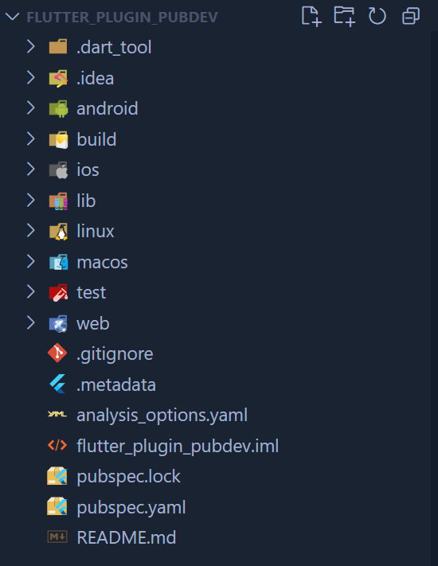
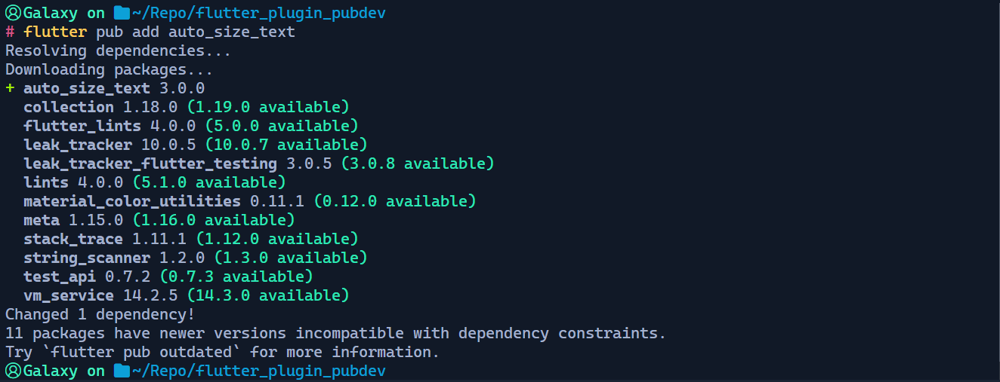
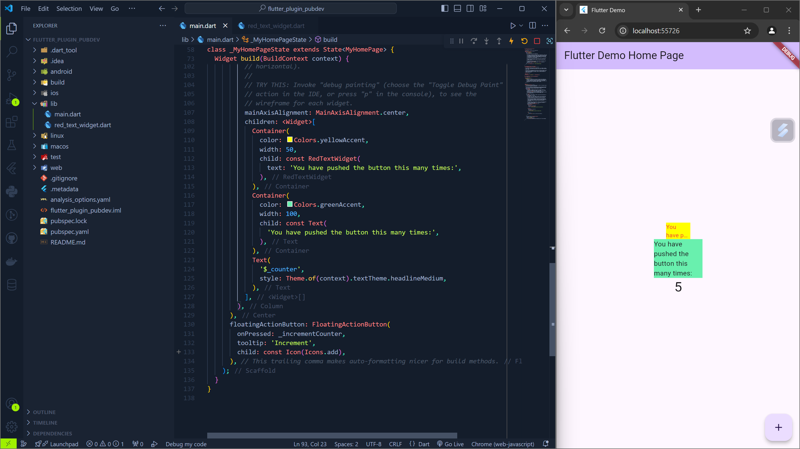

# #07 | Manajemen Plugin
## 7. Praktikum Menerapkan Plugin di Project Flutter
### Langkah 1: Buat Project Baru
Buatlah sebuah project flutter baru dengan nama `flutter_plugin_pubdev`. Lalu jadikan repository di GitHub Anda dengan nama `flutter_plugin_pubdev`.


### Langkah 2: Menambahkan Plugin
Tambahkan plugin `auto_size_text` menggunakan perintah berikut di terminal.


### Langkah 3: Buat file red_text_widget.dart
Buat file baru bernama `red_text_widget.dart` di dalam folder lib lalu isi kode seperti berikut.
```dart
import 'package:flutter/material.dart';

class RedTextWidget extends StatelessWidget {
  const RedTextWidget({Key? key}) : super(key: key);

  @override
  Widget build(BuildContext context) {
    return Container();
  }
}
```

### Langkah 4: Tambah Widget AutoSizeText
Masih di file `red_text_widget.dart`, untuk menggunakan plugin `auto_size_text`, ubahlah kode `return Container()` menjadi seperti berikut.
```dart
import 'package:flutter/material.dart';
import 'package:auto_size_text/auto_size_text.dart';

class RedTextWidget extends StatelessWidget {
  const RedTextWidget({Key? key}) : super(key: key);

  @override
  Widget build(BuildContext context) {
    return AutoSizeText(
      text,
      style: const TextStyle(color: Colors.red, fontSize: 14),
      maxLines: 2,
      overflow: TextOverflow.ellipsis,
    );
  }
}
```

### Langkah 5: Buat Variabel text dan parameter di constructor
Tambahkan variabel `text` dan parameter di constructor seperti berikut.
```dart
import 'package:flutter/material.dart';
import 'package:auto_size_text/auto_size_text.dart';

class RedTextWidget extends StatelessWidget {
  const RedTextWidget({Key? key, required this.text}) : super(key: key);
  final String text;

  @override
  Widget build(BuildContext context) {
    return AutoSizeText(
      text,
      style: const TextStyle(color: Colors.red, fontSize: 14),
      maxLines: 2,
      overflow: TextOverflow.ellipsis,
    );
  }
}
```

### Langkah 6: Tambahkan widget di main.dart
Buka file `main.dart` lalu tambahkan di dalam children: pada class `_MyHomePageState`
```dart
child: Column(
        mainAxisAlignment: MainAxisAlignment.center,
        children: <Widget>[
        Container(
            color: Colors.yellowAccent,
            width: 50,
            child: const RedTextWidget(
            text: 'You have pushed the button this many times:',
            ),
        ),
        Container(
            color: Colors.greenAccent,
            width: 100,
            child: const Text(
            'You have pushed the button this many times:',
            ),
        ),
        Text(
            '$_counter',
            style: Theme.of(context).textTheme.headlineMedium,
        ),
        ],
    ),
```

### Hasil


## Tugas
1. Selesaikan Praktikum tersebut, lalu dokumentasikan dan push ke repository Anda berupa screenshot hasil pekerjaan beserta penjelasannya di file README.md!
2. Jelaskan maksud dari langkah 2 pada praktikum tersebut!
Perintah
    ```console
    flutter pub add auto_size_text
    ```
    > Adalah perintah untuk menambahkan library/plugin flutter kedalam project flutter kita.
3. Jelaskan maksud dari langkah 5 pada praktikum tersebut!
    ```dart
    final String text;
    const RedTextWidget({Key? key, required this.text}) : super(key: key);
    ```
    > Menambahkan variabel `text` kedalam class `RedTextWidget` bertujuan untuk mendefinisikan variabel `text` sebagai string agar dapat digunakan.
4. Pada langkah 6 terdapat dua widget yang ditambahkan, jelaskan fungsi dan perbedaannya!
    ```dart
    children: <Widget>[
                Container(
                color: Colors.yellowAccent,
                width: 50,
                child: const RedTextWidget(
                    text: 'You have pushed the button this many times:',
                ),
                ),
                Container(
                color: Colors.greenAccent,
                width: 100,
                child: const Text(
                    'You have pushed the button this many times:',
                ),
                ),
                Text(
                '$_counter',
                style: Theme.of(context).textTheme.headlineMedium,
                ),
            ],
    ```
    - Container (1)
      Memberikan warna tampilan kuning, dan berisi turunan widget `RedTextWidget` yang berfungsi untuk mengembalikan widget `AutoSizeText`.
    - Container (2)
      Memberikan warna tampilan hijau, dan berisi turunan widget Text biasa.
5. Jelaskan maksud dari tiap parameter yang ada di dalam plugin `auto_size_text` berdasarkan tautan pada dokumentasi !
    - `minFontSize`: Menentukan ukuran font terkecil yang akan digunakan. Jika teks terlalu panjang untuk muat, font akan diperkecil hingga mencapai ukuran minimum ini.
    - `maxFontSize`: Menentukan ukuran font terbesar yang akan digunakan. Jika ada cukup ruang, font akan diperbesar hingga mencapai ukuran maksimum ini.
    - `stepGranularity`: Menentukan seberapa besar perubahan ukuran font setiap kali ukuran diubah. Nilai yang lebih kecil akan menghasilkan perubahan yang lebih halus.
    - `presetFontSizes`: Menentukan daftar ukuran font yang sudah ditentukan sebelumnya. Font akan disesuaikan ke salah satu ukuran dalam daftar ini.
    group: Mengizinkan beberapa elemen teks untuk menyesuaikan ukuran font secara bersamaan.
    - `textAlign`: Menentukan bagaimana teks akan disejajarkan secara horizontal (kiri, kanan, tengah, atau rata).
    - `textDirection`: Menentukan arah baca teks (kiri ke kanan atau kanan ke kiri).
    - `locale`: Digunakan untuk memilih font yang sesuai dengan bahasa dan wilayah tertentu.
    - `softWrap`: Menentukan apakah teks akan dibungkus ke baris berikutnya jika terlalu panjang untuk satu baris.
    - `wrapWords`: Menentukan apakah kata-kata dapat dipotong di akhir baris.
    - `overflow`: Menentukan apa yang terjadi jika teks terlalu panjang untuk muat dalam area yang disediakan (misalnya, dipotong, dihilangkan, atau ditampilkan dengan elipsis).
    - `overflowReplacement`: Menentukan widget yang akan ditampilkan jika teks terlalu panjang dan dipotong.
    - `textScaleFactor`: Mengubah ukuran font secara keseluruhan.
    - `maxLines`: Membatasi jumlah baris teks yang ditampilkan.
    - `semanticsLabel`: Menyediakan label alternatif untuk teks, yang digunakan oleh teknologi assistive seperti screen reader.
